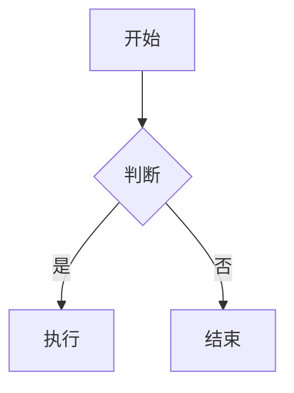

# Markdown 入门教程

> 本教程面向 **零基础** 读者。
> Markdown 是一种轻量级的标记语言，用简单的符号即可写出格式规整的文档，
> 被广泛用于 README、博客、笔记、GitHub、技术文档等场景。
> 你不需要任何特殊软件，**任何文本编辑器都能写 Markdown**。

---

## 目录

1. [Markdown 是什么](#1-markdown-是什么)
2. [常用编辑器与预览工具](#2-常用编辑器与预览工具)
3. [标题](#3-标题)
4. [段落与换行](#4-段落与换行)
5. [强调：粗体、斜体、删除线](#5-强调粗体斜体删除线)
6. [列表](#6-列表)
7. [链接](#7-链接)
8. [图片](#8-图片)
9. [引用](#9-引用)
10. [代码](#10-代码)
11. [表格](#11-表格)
12. [分割线与转义](#12-分割线与转义)
13. [任务清单](#13-任务清单)
14. [脚注与其他扩展语法](#14-脚注与其他扩展语法)
15. [进阶：Markdown 变体与实用技巧](#15-进阶markdown-变体与实用技巧)
16. [推荐工具与下一步学习](#16-推荐工具与下一步学习)

---

## 1. Markdown 是什么

**Markdown** 由 John Gruber 于 2004 年创建，是一种**轻量级标记语言**：

- 用一些**简单的符号**（如 `#`、`*`、`-`）表示格式；
- 文件是**纯文本**，后缀为 `.md` 或 `.markdown`；
- 可以被转换成 **HTML / PDF / Word** 等格式，最终渲染成美观的页面。

**核心思想：** 写起来像普通文本，读起来也像普通文本，渲染出来却是排版好的文档。

**优点：**

- 语法简单，几分钟即可上手；
- 纯文本，跨平台、易版本管理（Git）；
- 几乎所有技术社区都在用（GitHub、知乎、语雀、Obsidian、Typora…）；
- 专注内容本身，不用纠结格式。

**缺点：**

- 复杂排版能力有限（如精确分页、页眉页脚）；
- 不同工具对部分「扩展语法」支持不一致。

> 一句话总结：**Markdown 让你用写邮件的方式，写出带格式的文档。**

---

## 2. 常用编辑器与预览工具

Markdown 是纯文本，任何编辑器都能写，但带「实时预览」的工具体验更好：

| 工具 | 平台 | 特点 |
|------|------|------|
| **Typora** | Win / Mac | 所见即所得，最易上手 |
| **VS Code** | 全平台 | 免费，装插件后支持预览 |
| **Obsidian** | 全平台 | 免费，双向链接、笔记神器 |
| **语雀** | Web | 阿里出品，中文友好 |
| **GitHub / GitLab** | Web | 仓库自带 README 渲染 |
| **Mattermost / Slack / 飞书** | Web | 聊天、文档里都支持 Markdown |
| **Jupyter Notebook** | Web | 数据科学常用，Markdown 单元格 |

> 学习阶段：直接用 **VS Code** 或 **Typora**，或者任何在线 Markdown 编辑器
> （如 <https://dillinger.io/>）即可。

---

## 3. 标题

用 `#` 表示标题，`#` 的数量对应标题层级（1~6 级）。

```markdown
# 一级标题
## 二级标题
### 三级标题
#### 四级标题
##### 五级标题
###### 六级标题
```

**语法说明：**

- `#` 和标题文字之间要有**一个空格**（规范写法）；
- 1~2 级标题下可加一条分割线作为替代（见下），但推荐直接用 `#`。

```markdown
一级标题（替代写法）
===================

二级标题（替代写法）
-------------------
```

> 实际效果见本教程顶部的各级标题。

---

## 4. 段落与换行

- **段落**：由一或多行文字组成，段落之间用**空行**分隔。
- **换行**：
  - 在行尾加 **两个空格** 再回车 → 换行（标准 Markdown）；
  - 或者直接敲 **两次回车**（即空行）→ 变成新段落；
  - 很多工具（如 Typora、GitHub）也支持行尾 `\` 或直接单回车换行。

```markdown
这是第一段。
（上面没有空行，这里不算换行，会连在一起显示）

这是第二段，和第一段之间有空行。

这是第三段。  
这一行末尾有两个空格，所以换行到下一行。
```

| 写法 | 效果 |
|------|------|
| 一个回车 | 合并为同一行（中间变空格） |
| 行尾两个空格 + 回车 | 换行（不另起段落） |
| 两个回车（空行） | 另起新段落 |

---

## 5. 强调：粗体、斜体、删除线

| 语法 | 效果 |
|------|------|
| `**粗体**` | **粗体** |
| `*斜体*` | *斜体* |
| `***粗斜体***` | ***粗斜体*** |
| `~~删除线~~` | ~~删除线~~ |
| `<u>下划线</u>` | <u>下划线</u>（HTML 标签，部分工具支持） |

```markdown
**重点内容**，*补充说明*，***标题强调***，~~过时信息~~。
```

> 注意：`*` 与文字之间**不要有空格**，否则会被当成普通字符。
> 部分工具（如 GitHub）也支持用 `_` 代替 `*`：`_斜体_`、`__粗体__`。

---

## 6. 列表

### 6.1 无序列表

用 `-`、`*` 或 `+` 加空格：

```markdown
- 苹果
- 香蕉
- 橘子
```

### 6.2 有序列表

用 `1.` 加空格：

```markdown
1. 第一步
2. 第二步
3. 第三步
```

> 序号可以随意写，多数渲染器会**自动按顺序编号**（如全部写 `1.` 也能正确递增）。

### 6.3 嵌套列表

子列表前缩进 **2~4 个空格**：

```markdown
- 水果
  - 苹果
  - 香蕉
- 蔬菜
  1. 白菜
  2. 萝卜
```

### 6.4 列表中的段落与代码

在列表项内换行写内容时，需要保持缩进；代码块用 4 个空格或反引号：

```markdown
- 第一项

  这里是与第一项同级的段落（缩进 2 格）。

  ```python
  print("hello")
  ```

- 第二项
```

---

## 7. 链接

### 7.1 行内式链接

```markdown
[链接文字](https://example.com)

[带标题的链接](https://example.com "鼠标悬停提示")
```

效果：[链接文字](https://example.com)

### 7.2 引用式链接

把链接定义在文档任意位置，多次引用：

```markdown
[Overleaf][overleaf] 和 [GitHub][gh] 都支持 Markdown。

[overleaf]: https://www.overleaf.com
[gh]: https://github.com
```

### 7.3 自动链接

```markdown
<https://www.overleaf.com>
```

效果：<https://www.overleaf.com>

### 7.4 锚点链接（跳转到文档内标题）

```markdown
[跳转到开头](#markdown-是什么)
```

> 锚点规则：标题全小写、空格变连字符、去掉标点。不同工具规则略有差异，
> 但大多遵循这个约定。

### 7.5 相对链接（本地文件）

```markdown
[查看说明文档](docs/readme.md)
[下载文件](files/report.pdf)
```

GitHub 等平台会自动跳转到仓库内对应文件。

---

## 8. 图片

语法与链接类似，前面加一个 `!`：

```markdown


```

示例（本地相对路径）：

```markdown

```

**说明：**

- `!` 后面的方括号里是**替代文字**（图片加载失败或屏幕阅读器会用到）；
- 圆括号里是图片路径：可以是本地相对路径，也可以是网络 URL；
- 想要**控制图片大小**，标准 Markdown 做不到，可借助 HTML（见第 15 节）。

---

## 9. 引用

用 `>` 表示引用，可嵌套，可包含其他 Markdown 语法：

```markdown
> 这是一段引用。

> 多行引用
> 每行前面都可以加 `>`。

> 引用可以嵌套
>
> > 这是嵌套的引用。

> 引用里也能放列表：
>
> - 第一项
> - 第二项
```

效果：

> 这是一段引用。
>
> 引用里也能放列表：
>
> - 第一项
> - 第二项

---

## 10. 代码

### 10.1 行内代码

用一对反引号包裹：

```markdown
请在终端运行 `npm install` 命令。
```

效果：请在终端运行 `npm install` 命令。

### 10.2 代码块（围栏式）

用三个反引号包裹，**可指定语言**以启用语法高亮：

````markdown
```python
def hello(name):
    print(f"Hello, {name}!")
```

```javascript
console.log("Hello, world!");
```
````

渲染效果：

```python
def hello(name):
    print(f"Hello, {name}!")
```

> 语言标识可选：`python`、`javascript`、`bash`、`json`、`java`、`c`、`cpp`、
> `sql`、`html`、`latex` 等。不写语言也能显示纯文本代码块。

### 10.3 代码块（缩进式）

缩进 4 个空格或一个 Tab 也表示代码块（老式语法），但不能高亮：

```markdown
    print("这是一行代码")
```

### 10.4 代码块内含有三个反引号

如果代码内容本身就包含三个反引号，用**四个反引号**包裹：

`````markdown
````markdown
```python
print("hello")
```
````
`````

---

## 11. 表格

用管道符 `|` 和连字符 `-` 构建表格，第二行定义对齐方式：

```markdown
| 左对齐 | 居中 | 右对齐 |
| :----- | :--: | -----: |
| 苹果   | 香蕉 |  橘子  |
| 100    | 200  |  300   |
```

渲染效果：

| 左对齐 | 居中 | 右对齐 |
| :----- | :--: | -----: |
| 苹果   | 香蕉 |  橘子  |
| 100    | 200  |  300   |

**语法说明：**

| 第二行写法 | 对齐 |
|------------|------|
| `------` | 默认左对齐 |
| `:-----` | 左对齐 |
| `:----:` | 居中对齐 |
| `-----:` | 右对齐 |

**注意：**

- 每行的列数要一致，表头分隔行**必须有**（至少 3 个 `-`）；
- 单元格内可以放链接、行内代码等，但**不能**直接放列表或多行段落；
- 单元格内有 `|` 时需转义为 `\|`。

```markdown
| 函数 | 说明 |
|------|------|
| `abs(x)` | 返回绝对值 `\|x\|` |
```

---

## 12. 分割线与转义

### 12.1 分割线

用三个或以上连续的 `-`、`*` 或 `_`（独占一行）：

```markdown
---

***

___
```

渲染效果：

---

> 注意：单独一行的 `-` 若下方紧跟文字，可能被识别为二级标题，请确保分割线上下都是空行。

### 12.2 转义特殊字符

Markdown 的格式符号需要转义才能原样显示，用反斜杠 `\`：

```markdown
\*星号\* 不会变成斜体
\# 井号不会变成标题
\[ 方括号 \] 不会变成链接
```

**需要转义的字符：**

```
\ ` * _ { } [ ] ( ) # + - . !
```

示例：`2 \* 3` 显示为 `2 * 3`。

---

## 13. 任务清单

GitHub / Typora / Obsidian 等支持任务清单语法：

```markdown
- [ ] 未完成的任务
- [x] 已完成的任务
```

效果：

- [ ] 未完成的任务
- [x] 已完成的任务

> 空格或 `x`（不区分大小写）放在方括号内。部分工具点击方框即可切换完成状态。

---

## 14. 脚注与其他扩展语法

以下语法属于 **GitHub 风格 / 各工具扩展**，并非所有平台都支持。

### 14.1 脚注

```markdown
这是一段话[^1]。

[^1]: 这是脚注的内容，通常在页面底部显示。
```

### 14.2 高亮

```markdown
==高亮文字==
```

效果：==高亮文字==（部分工具支持）

### 14.3 上下标（部分工具支持）

```markdown
H~2~O         （下标，GitHub 支持）
x^2^          （上标，Typora 支持）
```

### 14.4 Emoji

```markdown
:smile:  :rocket:  :tada:
```

效果：:smile: :rocket: :tada:（部分平台会自动渲染为图标）

### 14.5 目录（部分工具支持）

```markdown
[TOC]
```

在 Typora 等工具中会生成文档目录。

### 14.6 折叠块（GitHub 支持）

```markdown
<details>
<summary>点击展开查看详情</summary>

这里是折叠的内容。

</details>
```

---

## 15. 进阶：Markdown 变体与实用技巧

### 15.1 常见变体（方言）

| 变体 | 平台 | 主要扩展 |
|------|------|----------|
| **GFM** | GitHub | 任务清单、表格、删除线、自动链接 |
| **CommonMark** | 通用标准 | 标准化的核心语法 |
| **Typora** | 本地 | TOC、上下标、流程图 |
| **Obsidian** | 本地 | 双向链接、Callout、LaTeX 公式 |
| **GitLab Flavored** | GitLab | 类似 GFM，额外支持 Mermaid |

> 建议以 **CommonMark + GFM** 为基准写，兼容性最好。

### 15.2 在 Markdown 中插入 HTML

Markdown 允许内嵌 HTML，可用来实现标准语法做不到的效果：

```markdown
<div align="center">
  
</div>

<br>
```

### 15.3 数学公式（LaTeX）

不少工具（Typora、Obsidian、GitHub、语雀）支持在 Markdown 中写 LaTeX 公式：

```markdown
行内公式：$e^{i\pi} + 1 = 0$

行间公式：
$$
\int_0^\infty e^{-x^2}\,dx = \frac{\sqrt{\pi}}{2}
$$
```

渲染效果（以支持公式的工具为例）：

$$
\int_0^\infty e^{-x^2}\,dx = \frac{\sqrt{\pi}}{2}
$$

### 15.4 画流程图（Mermaid）

GitHub、语雀、Obsidian 等支持 Mermaid 图表：

````markdown

````

### 15.5 实用写作技巧

1. **空行大法**：空行是「段落」的分界，也是很多语法（标题、列表、代码块）正确解析的前提，拿不准就加空行。
2. **先打草稿再排版**：先用普通文本写内容，再套用 `#`、`-`、`**` 等标记。
3. **统一格式**：列表符号全用 `-`，标题层级不跳级（比如不要从 `#` 直接跳 `###`）。
4. **用相对路径引用图片/文件**，方便整个仓库移植。
5. **重要数据用表格**，重点用 **粗体**，举例用 `行内代码`，条理立刻清晰。

---

## 16. 推荐工具与下一步学习

### 16.1 工具推荐

| 场景 | 推荐 |
|------|------|
| 快速编辑 + 预览 | Typora、VS Code + Markdown All in One 插件 |
| 知识笔记管理 | Obsidian、语雀、Notion |
| 技术文档 / README | GitHub、GitLab、VitePress、Docusaurus |
| 博客写作 | Hexo、Hugo、VuePress、Halo |
| 命令行快速编辑 | vim / nano（加上预览插件） |

### 16.2 下一步进阶方向

1. **静态网站 / 博客**：用 VitePress、Hugo、Hexo 把 Markdown 变成网站。
2. **API 文档工具**：MkDocs、Docusaurus。
3. **与 LaTeX 结合**：Markdown 写正文 + 用 Pandoc 转成 PDF/Word，公式与引用交给 LaTeX 引擎。
4. **CI 自动化**：GitHub Actions 中自动把 Markdown 渲染成 PDF 发布。
5. **数据可视化**：用 Mermaid / PlantUML 在 Markdown 里画图。

### 16.3 学习资源

- CommonMark 规范：<https://commonmark.org>
- GitHub Markdown 文档：<https://docs.github.com/zh/get-started/writing-on-github>
- Markdown Guide：<https://www.markdownguide.org>
- Pandoc（格式转换神器）：<https://pandoc.org>

---

## 附录：完整示例

把下面内容保存为 `demo.md`，用任意支持 Markdown 的工具打开预览：

```markdown
# 项目说明文档

## 简介

这是一个 **演示项目**，用于展示 *Markdown* 的基本写法。

## 功能列表

- [x] 支持标题
- [x] 支持列表与表格
- [ ] 支持自定义主题

## 快速开始

```bash
npm install
npm run dev
```

## 配置示例

| 配置项   | 默认值 | 说明         |
| -------- | :----: | ------------ |
| `theme`  | light  | 主题色       |
| `lang`   | zh-CN  | 界面语言     |
| `debug`  | false  | 是否开启调试 |

## 目录结构

```text
project/
├── src/       源码目录
├── docs/      文档目录
└── README.md  本文件
```

## 引用与链接

> 更多说明请访问 [项目主页](https://example.com)。

## 公式（需工具支持）

$$
S(n) = \sum_{i=1}^{n} i = \frac{n(n+1)}{2}
$$
```

---

### 快速记忆卡

```
标题       : #  ~  ######
段落       : 空行分隔
换行       : 行尾两个空格
粗体       : **文字**
斜体       : *文字*
删除线     : ~~文字~~
无序列表   : - 项
有序列表   : 1. 项
链接       : [文字](URL)
图片       : 
引用       : > 内容
行内代码   : `code`
代码块     : ```语言
表格       : | a | b |  +  --- 行
分割线     : ---
任务清单   : - [ ] / - [x]
```

祝写作愉快，让排版回归简单！
