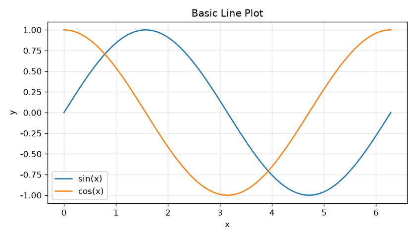
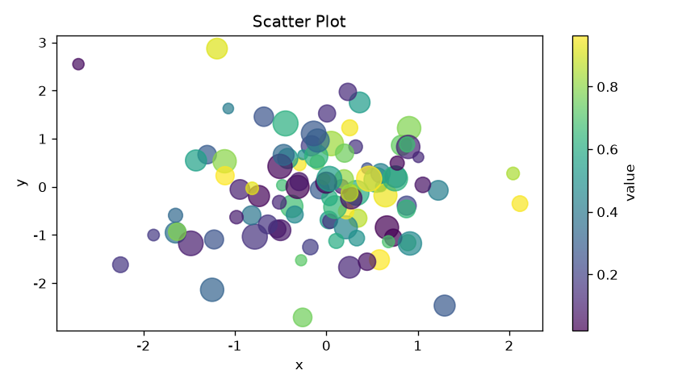
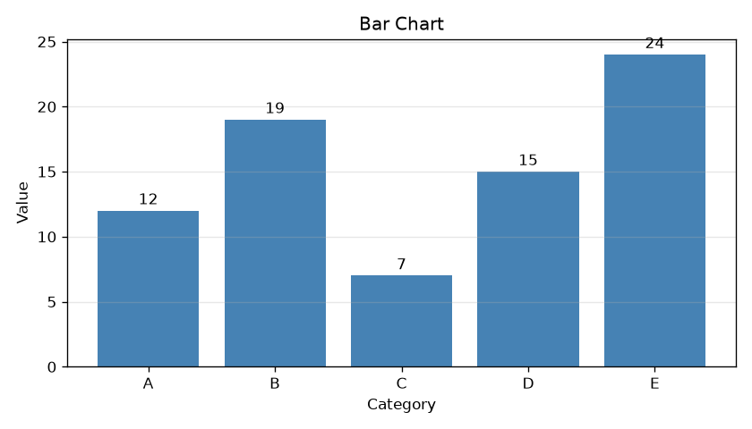
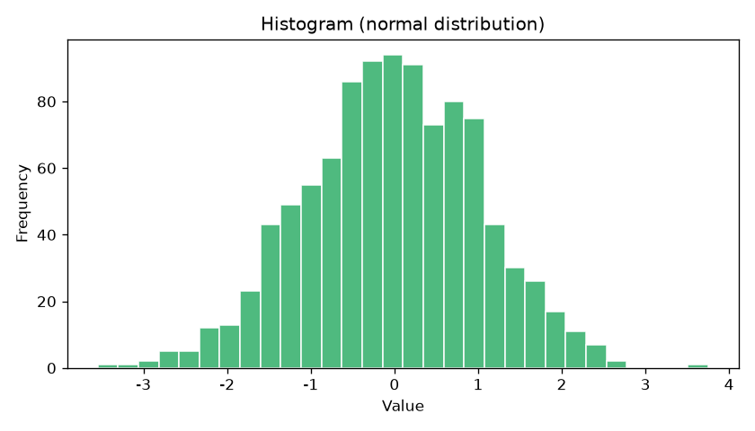
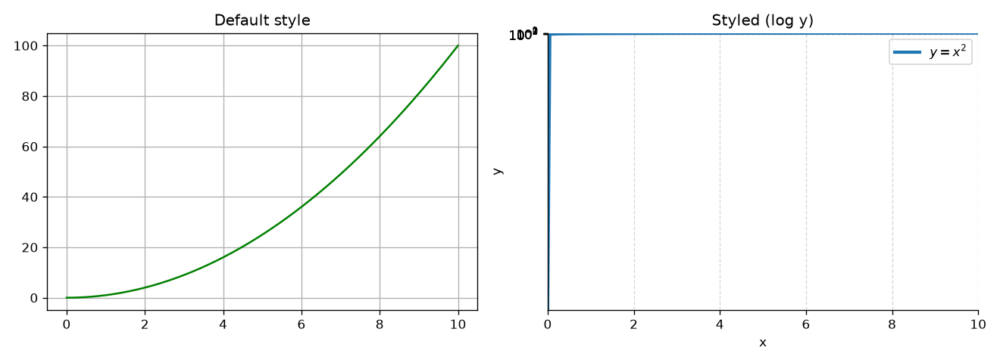
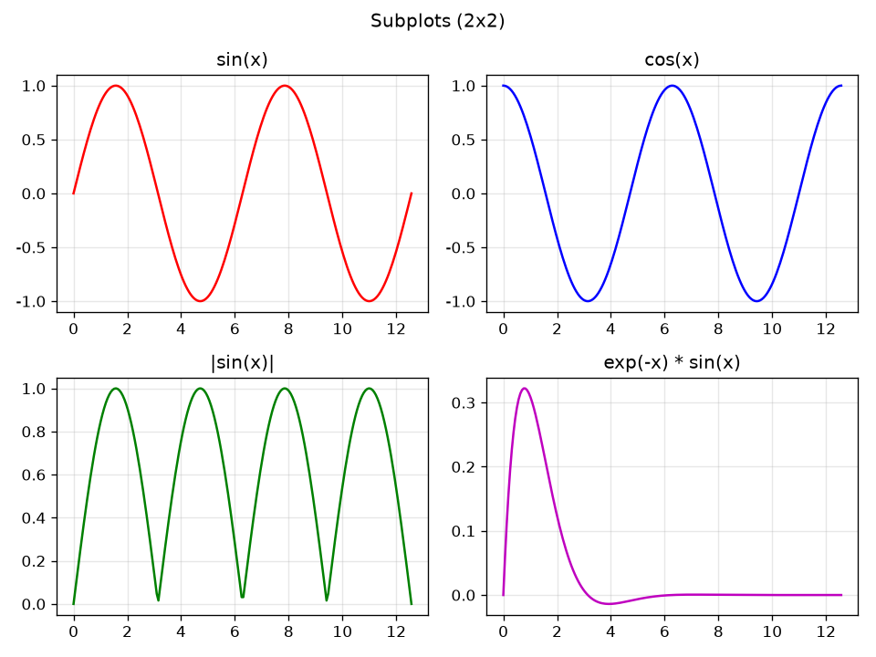
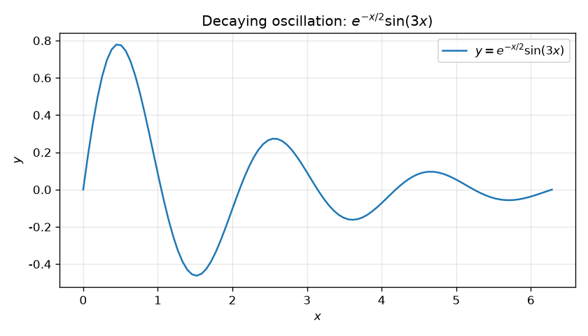

# Matplotlib 入门教程

> 本教程面向 **零基础** 读者。
> Matplotlib 是 Python 里最常用的**绘图库**，只需几行代码就能画出
> 折线图、散点图、柱状图、直方图等，还能把图保存成 PNG、PDF、SVG 等格式。
> 本教程所有插图均用真实代码生成，跟着做就能得到一模一样的结果。

---

## 目录

1. [Matplotlib 是什么](#1-matplotlib-是什么)
2. [安装与环境](#2-安装与环境)
3. [快速开始：你的第一张图](#3-快速开始你的第一张图)
4. [核心概念：Figure 与 Axes](#4-核心概念figure-与-axes)
5. [常用图表类型](#5-常用图表类型)
6. [美化你的图](#6-美化你的图)
7. [子图：subplots](#7-子图subplots)
8. [保存图片](#8-保存图片)
9. [文本注释与数学公式](#9-文本注释与数学公式)
10. [全局样式与风格](#10-全局样式与风格)
11. [常见问题与技巧](#11-常见问题与技巧)
12. [下一步学习](#12-下一步学习)

---

## 1. Matplotlib 是什么

**Matplotlib** 是 Python 生态中最经典、最通用的**二维绘图库**，由 John D. Hunter 于 2003 年创建：

- 用**面向对象**的方式把「数据」画成「图表」，底层基于 NumPy 数组；
- 支持**折线图、散点图、柱状图、直方图、饼图、箱线图、等高线**等几十种图表；
- 可输出 **PNG、PDF、SVG、EPS** 等多种格式，适合论文、报告、网页；
- 常配合 **NumPy**（数据）和 **Pandas**（表格数据）一起使用。

**优点：**

- 功能强大、思路贴近「画图」这一本质；
- 是 Pandas 绘图、Seaborn 等高级库的**底层引擎**；
- 自定义程度极高，几乎能改图上的一切细节。

**缺点：**

- 新手上手有一点概念门槛（`Figure` 和 `Axes` 的区别）；
- 默认样式偏「学术」，想要美观需要自己调。

> 一句话总结：**Matplotlib 让你用 Python 把数据变成图片。**

---

## 2. 安装与环境

### 2.1 安装

```bash
# 只装 matplotlib
pip install matplotlib

# 推荐：连同 numpy 一起装（数据处理常用）
pip install matplotlib numpy

# 国内网络慢可换镜像源
pip install matplotlib -i https://pypi.tuna.tsinghua.edu.cn/simple
```

### 2.2 验证安装

```python
import matplotlib
print(matplotlib.__version__)
```

### 2.3 推荐使用方式

建议使用 **Jupyter Notebook / VS Code**，或在交互式 Python 中绘图。两种「显示方式」：

| 场景 | 写什么 | 效果 |
|------|--------|------|
| Jupyter 单元格 | 直接 `plt.show()` | 图内联显示在单元格下方 |
| 普通 `.py` 脚本 | `plt.savefig("a.png")` + `plt.show()` | 保存文件并弹出窗口 |

> 如果是在**服务器/无界面**环境运行（如下面的示例脚本），请在导入后加上
> `matplotlib.use("Agg")`，再用 `plt.savefig()` 保存，就不会因缺少显示器而报错。

---

## 3. 快速开始：你的第一张图

下面这段代码画出了正弦 `sin(x)` 和余弦 `cos(x)` 两条曲线：

```python
import numpy as np
import matplotlib.pyplot as plt

# 1. 生成数据：0 到 2π 之间的 100 个点
x = np.linspace(0, 2 * np.pi, 100)
y1 = np.sin(x)
y2 = np.cos(x)

# 2. 画两条折线
plt.plot(x, y1, label="sin(x)")
plt.plot(x, y2, label="cos(x)")

# 3. 加上标题、坐标轴标签、图例、网格
plt.title("Basic Line Plot")
plt.xlabel("x")
plt.ylabel("y")
plt.legend()
plt.grid(True, alpha=0.3)

# 4. 显示
plt.show()
```

效果：



**最小可运行结构**其实就是三步：**造数据 → 画图 → 显示**。其余都是「锦上添花」。

---

## 4. 核心概念：Figure 与 Axes

这是 Matplotlib 最重要、也最让新手困惑的一组概念。

| 概念 | 英文 | 比喻 | 说明 |
|------|------|------|------|
| **图（画布）** | `Figure` | 一整张画纸 | 容纳所有内容的**大容器**，可设置大小 `figsize`、背景等 |
| **坐标轴（子图）** | `Axes` | 画纸上的一个**作图区域** | 真正画数据的地方，可放多个，坐标轴、刻度、标题都在它上面 |
| **轴（线）** | `Axis` | 画区的 x / y 边界线 | 一条坐标轴，包含刻度、刻度标签、轴名 |

- `plt.plot()` 这种「快速写法」由 pyplot 自动帮你建一个 `Figure` 和一个 `Axes`；
- 想画多个子图时，就用对象写法自己创建，更清晰。

**两种写法对比：**

```python
# 写法一：pyplot 快速写法（简单，单图够用）
plt.plot([1, 2, 3], [2, 4, 3])
plt.show()

# 写法二：面向对象写法（灵活，多图/复杂布局推荐）
fig, ax = plt.subplots(figsize=(6, 4))   # 返回 (Figure, Axes)
ax.plot([1, 2, 3], [2, 4, 3])
ax.set_title("my plot")
fig.savefig("out.png")
```

> **建议**：入门阶段两种都练一练。后面画子图时，面向对象写法会明显更好用。

---

## 5. 常用图表类型

### 5.1 折线图

用于看数据**随某个变量（通常是 x）的变化趋势**。

```python
import numpy as np
import matplotlib.pyplot as plt

x = np.linspace(0, 10, 100)
plt.plot(x, x ** 2, label=r"$y=x^2$")
plt.plot(x, x ** 3, label=r"$y=x^3$")
plt.xlabel("x")
plt.ylabel("y")
plt.legend()
plt.show()
```

常用参数（`plt.plot` / `ax.plot`）：

| 参数 | 作用 | 例子 |
|------|------|------|
| `linestyle` | 线型 | `"-"` 实线，`"--"` 虚线，`":"` 点线，`"-."` 点划线 |
| `linewidth` | 线宽 | `linewidth=2` |
| `color` | 颜色 | `"red"`、`"tab:blue"`、`"#1f77b4"` |
| `marker` | 数据点标记 | `"o"` 圆、`"s"` 方块、`"^"` 三角、`"*"` 星号 |
| `label` | 图例名称 | `label="sin(x)"` |

### 5.2 散点图

用于看**两个变量之间的关系、聚类、分布**，常配合颜色和大小表示额外信息。

```python
import numpy as np
import matplotlib.pyplot as plt

rng = np.random.default_rng(1)
x = rng.normal(size=100)
y = rng.normal(size=100)
c = rng.random(100)        # 颜色
s = rng.random(100) * 300 + 50   # 大小

plt.scatter(x, y, c=c, s=s, alpha=0.7, cmap="viridis")
plt.colorbar(label="value")
plt.show()
```

效果（颜色代表数值，颜色条 `colorbar` 说明含义）：



### 5.3 柱状图

用于**对比不同类别的数值大小**。`plt.bar` 画竖直柱，`plt.barh` 画水平柱。

```python
import matplotlib.pyplot as plt

names = ["A", "B", "C", "D", "E"]
values = [12, 19, 7, 15, 24]

plt.bar(names, values, color="steelblue")
plt.xlabel("Category")
plt.ylabel("Value")
for i, v in enumerate(values):
    plt.text(i, v + 0.5, str(v), ha="center")   # 在柱顶标数值
plt.show()
```

效果：



**其他柱状图变体：**

| 需求 | 用哪个 |
|------|--------|
| 水平柱状图 | `plt.barh(y, width)` |
| 分组柱状图 | 多次 `bar` 并调整 `x` 偏移 |
| 堆叠柱状图 | 多次 `bar` 并设置 `bottom` 参数 |

### 5.4 直方图

用于看**数据的分布形状**（是否正态、有没有偏斜、有无离群值）。

```python
import numpy as np
import matplotlib.pyplot as plt

data = np.random.default_rng(1).normal(loc=0, scale=1, size=1000)
plt.hist(data, bins=30, color="mediumseagreen", edgecolor="white")
plt.xlabel("Value")
plt.ylabel("Frequency")
plt.show()
```

效果：



关键参数：`bins` 决定柱子的数量/边界，`density=True` 可把纵轴改为概率密度。

### 5.5 饼图

用于展示**各部分占整体的比例**。

```python
labels = ["A", "B", "C", "D"]
sizes = [30, 20, 25, 25]
plt.pie(sizes, labels=labels, autopct="%.1f%%", startangle=90)
plt.axis("equal")   # 保证饼是正圆
plt.show()
```

### 5.6 箱线图

用于看数据的**分布、中位数和离群值**，非常适合做数据探索。

```python
import numpy as np
import matplotlib.pyplot as plt

rng = np.random.default_rng(2)
data = [rng.normal(0, 1, 100), rng.normal(2, 1.5, 100), rng.normal(-1, 0.5, 100)]
plt.boxplot(data, labels=["a", "b", "c"])
plt.show()
```

### 5.7 其他常用图

| 图表 | 函数 | 用途 |
|------|------|------|
| 误差棒 | `plt.errorbar` | 展示数据的不确定性 |
| 等高线/热力图 | `plt.contourf` / `plt.imshow` | 二维数据分布 |
| 填充图 | `plt.fill_between` | 两条曲线之间的区域 |
| 矢量场 | `plt.quiver` | 展示向量场 |
| 极坐标 | `plt.polar` / `projection="polar"` | 角度数据 |

---

## 6. 美化你的图

好的图清楚、美观。这里列出最常用的美化手段。

### 6.1 标题与坐标轴标签

```python
plt.title("标题", fontsize=16)
plt.xlabel("x", fontsize=12)
plt.ylabel("y", fontsize=12)
```

在对象写法里用 `ax.set_title`，但更常用连写法：

```python
ax.set(title="标题", xlabel="x", ylabel="y")
```

### 6.2 图例

```python
plt.plot(x, y1, label="线1")
plt.plot(x, y2, label="线2")
plt.legend()                      # 自动放在合适位置
plt.legend(loc="upper right")     # 指定位置
plt.legend(fontsize=10, framealpha=0.5)
```

`loc` 常用值：`best`、`upper right`、`lower left`、`center` 等。

### 6.3 坐标范围与刻度

```python
plt.xlim(0, 10)       # x 轴范围
plt.ylim(-1, 1)       # y 轴范围
plt.xticks([0, 5, 10])         # 手动指定刻度位置
plt.xticks(rotation=45)        # 旋转刻度标签（防重叠）
plt.yscale("log")              # y 轴用对数刻度
```

### 6.4 颜色、线型与标记

```python
plt.plot(x, y, color="tab:blue", linewidth=2.5,
         linestyle="--", marker="o", markersize=4,
         label="data")
```

**常用颜色：** `"r"`红、`"g"`绿、`"b"`蓝、`"k"`黑、`"orange"`、`"purple"`，
以及 matplotlib 自带的 `"tab:10"` 配色（`tab:blue`、`tab:orange`…）。
也可以用十六进制如 `"#1f77b4"`。

### 6.5 网格与边框

```python
plt.grid(True)                       # 开网格
plt.grid(True, linestyle="--", alpha=0.5)   # 虚线、半透明
ax.spines["top"].set_visible(False)  # 隐藏上边框
ax.spines["right"].set_visible(False) # 隐藏右边框
```

### 6.6 完整对比

下面把「默认」和「美化」放在一起看差别：

```python
import numpy as np
import matplotlib.pyplot as plt

x = np.linspace(0, 10, 200)

fig, axs = plt.subplots(1, 2, figsize=(11, 4))

# 左边：默认样式
axs[0].plot(x, x ** 2, "g")
axs[0].set_title("Default style")
axs[0].grid(True)

# 右边：美化（对数坐标 + 去掉多余边框 + 虚线网格）
axs[1].plot(x, x ** 2, color="tab:blue", linewidth=2.5, label=r"$y=x^2$")
axs[1].set(title="Styled", xlabel="x", ylabel="y")
axs[1].set_ylim(0, 110)
axs[1].legend()
axs[1].grid(True, linestyle="--", alpha=0.5)
axs[1].spines["top"].set_visible(False)
axs[1].spines["right"].set_visible(False)
axs[1].set_yscale("log")

fig.tight_layout()
fig.savefig("styled.png")
```

效果：



> `fig.tight_layout()` 能自动调整子图间距，避免标签被切掉，强烈建议每次都加。

---

## 7. 子图：subplots

一图放多个小图，适合**对比展示多组数据**。最常用的是 `plt.subplots(m, n)`，它返回一个 `Figure` 和一个 `Axes` 组成的二维数组。

```python
import numpy as np
import matplotlib.pyplot as plt

x = np.linspace(0, 4 * np.pi, 200)

fig, axes = plt.subplots(2, 2, figsize=(8, 6))

axes[0, 0].plot(x, np.sin(x), "r");    axes[0, 0].set_title("sin(x)")
axes[0, 1].plot(x, np.cos(x), "b");    axes[0, 1].set_title("cos(x)")
axes[1, 0].plot(x, np.abs(np.sin(x)), "g"); axes[1, 0].set_title("|sin(x)|")
axes[1, 1].plot(x, np.exp(-x) * np.sin(x), "m"); axes[1, 1].set_title("exp(-x)*sin(x)")

for ax in axes.ravel():        # 把二维数组展平，统一设置
    ax.grid(True, alpha=0.3)

fig.suptitle("Subplots (2x2)")   # 整张图的大标题
fig.tight_layout()
plt.show()
```

效果：



**进阶技巧：**

| 需求 | 做法 |
|------|------|
| 共享 x 轴 | `plt.subplots(2, 1, sharex=True)` |
| 不同大小 | `fig, axs = plt.subplots(2, 2, gridspec_kw={"height_ratios": [1, 2]})` |
| 精细布局 | 用 `plt.subplot2grid` 或 `fig.add_gridspec` |
| 双子坐标轴 | 用 `ax.twinx()` 在右侧再加一个 y 轴 |

---

## 8. 保存图片

保存图用 `savefig`，支持非常丰富的格式。**一定要放在 `plt.show()` 之前调用**，否则保存的是空图（有些环境 `show` 会清空画布）。

```python
plt.savefig("plot.png")                    # PNG，默认 dpi=100
plt.savefig("plot.png", dpi=300)           # 高清，适合打印/论文
plt.savefig("plot.pdf")                    # 矢量图，放大不失真
plt.savefig("plot.svg")                    # SVG，适合网页
plt.savefig("plot.jpg", bbox_inches="tight")  # 自动裁剪空白
```

**注意：**

- 用 `bbox_inches="tight"` 可以避免标签被裁剪；
- 论文投稿通常用 **PDF / EPS / 300dpi 的 PNG**；
- 想保存多张图，每画完一张就 `savefig` 再 `plt.close()` 释放内存。

---

## 9. 文本注释与数学公式

### 9.1 添加文字

`plt.text(x, y, "文字")` 在指定坐标写文字，`plt.annotate` 可加箭头。

```python
plt.text(2, 0.5, "注释文字", fontsize=12, color="red")
plt.annotate("峰值", xy=(np.pi / 2, 1), xytext=(2.5, 1.2),
             arrowprops=dict(arrowstyle="->"))
```

### 9.2 数学公式（mathtext）

在标签字符串里用 **`$...$`** 就能写 LaTeX 风格的数学公式，无需额外安装任何东西。

```python
plt.plot(x, np.exp(-x / 2) * np.sin(3 * x), label=r"$y=e^{-x/2}\sin(3x)$")
plt.xlabel(r"$x$")
plt.title(r"Decaying oscillation: $e^{-x/2}\sin(3x)$")
```

效果（标题和图的公式都用上了 mathtext）：



**常用写法：**

| 想要的效果 | 写法 |
|------------|------|
| 上标 | `x^2`、`e^{-x}` |
| 下标 | `x_1` |
| 分数 | `\frac{a}{b}` |
| 根号 | `\sqrt{x}` |
| 希腊字母 | `\alpha`、`\beta`、`\pi`、`\theta` |
| 求和 | `\sum_{i=1}^{n}` |
| 积分 | `\int_0^1` |
| 函数名 | `\sin`、`\cos`、`\log` |

> 提示：字符串前加 `r`（如 `r"$...$"`）表示原始字符串，可避免反斜杠被转义。

---

## 10. 全局样式与风格

### 10.1 主题风格

Matplotlib 内置多种**整体风格**，一条命令切换：

```python
import matplotlib.pyplot as plt

plt.style.use("seaborn-v0_8")      # 更现代、更柔和
plt.style.use("ggplot")            # 类似 R 的 ggplot 风格
plt.style.use("dark_background")   # 深色背景
plt.style.use("bmh")               # 蓝色主题
```

查看所有风格：`print(plt.style.available)`。

### 10.2 rcParams 全局配置

`plt.rcParams` 可以设置全局默认，省去每个图都重写一遍。

```python
plt.rcParams["figure.figsize"] = (8, 5)
plt.rcParams["font.family"] = "sans-serif"
plt.rcParams["font.sans-serif"] = ["SimHei", "DejaVu Sans"]  # 中文字体
plt.rcParams["axes.unicode_minus"] = False   # 正常显示负号
plt.rcParams["lines.linewidth"] = 2
```

> **关于中文**：Matplotlib 默认字体不含中文，直接画中文会显示成方框。
> 解决办法是设置一个中文字体（如 `SimHei`、`Noto Sans CJK SC`）。
> 若你的系统没有中文字体，最简单是先用英文标签。

### 10.3 默认配色（tab10）

新版 matplotlib 默认用一套对色盲友好、同一色系不同深浅的 `tab` 配色，
一组曲线时自动轮换，不用手动指定，效果也足够好。

---

## 11. 常见问题与技巧

### 11.1 图没显示/一下闪过

- Jupyter 里请加 `%matplotlib inline`；
- 普通脚本在 `plt.show()` 后会阻塞窗口，关闭即可继续；
- 无界面环境用 `matplotlib.use("Agg")` + `savefig`。

### 11.2 中文变方框

```python
import matplotlib.pyplot as plt
plt.rcParams["font.sans-serif"] = ["SimHei", "Microsoft YaHei", "Noto Sans CJK SC"]
plt.rcParams["axes.unicode_minus"] = False
```

### 11.3 画布太挤、标签重叠

```python
fig.tight_layout()
# 或
fig.subplots_adjust(top=0.9, right=0.95, hspace=0.3)
```

### 11.4 让某条线更突出

调整 `zorder`（图层顺序）或直接在后面重新画一次。

```python
ax.plot(x, y, "b--", zorder=1)
ax.plot(x[::5], y[::5], "ro", zorder=2)   # 点画在线上层
```

### 11.5 用 Pandas 一键出图

如果数据是 DataFrame，可以直接：

```python
df.plot(kind="line")      # 折线
df.plot(kind="bar")       # 柱状
df.plot(kind="scatter", x="a", y="b")
df["col"].hist()          # 某列的直方图
```

### 11.6 常用快捷键（面向对象写法速查）

| 想做的事 | 写法 |
|----------|------|
| 设标题/轴标签 | `ax.set(title=..., xlabel=..., ylabel=...)` |
| 设范围 | `ax.set_xlim(...)`、`ax.set_ylim(...)` |
| 加网格 | `ax.grid(True)` |
| 加图例 | `ax.legend()` |
| 保存 | `fig.savefig(...)` |

---

## 12. 下一步学习

### 12.1 练习建议

1. 把第 3 节的第一个例子跑起来，改成画 `x^3` 并加上标记；
2. 生成一组随机数，画它的直方图，并试试不同 `bins`；
3. 做一个 2x2 子图，展示正弦、余弦、正切和它们的平方；
4. 用 `plt.pie` 画出你一天时间分配的占比；
5. 试着用 `savefig` 导出一张 300dpi 的图，并加 `bbox_inches="tight"`。

### 12.2 进阶方向

| 方向 | 说明 | 库 |
|------|------|------|
| 统计图表 | 更省事的高级绘图 | **Seaborn**（基于 matplotlib） |
| 交互式图表 | 可缩放、悬停看数据 | **Plotly**、**Bokeh** |
| 动态图表 | 动画/实时更新 | **matplotlib.animation** |
| 3D 绘图 | 三维曲面/散点 | **mpl_toolkits.mplot3d** |
| 地理数据 | 地图可视化 | **GeoPandas / Cartopy** |

### 12.3 官方资源

- 官方文档：<https://matplotlib.org/stable/>
- 官方教程：<https://matplotlib.org/stable/tutorials/index.html>
- 画廊（大量示例，直接复制改）：<https://matplotlib.org/stable/gallery/>

---

## 附录：一张图从 0 到 1 的标准模板

把下面代码保存为 `demo.py`，替换数据即可直接用：

```python
import numpy as np
import matplotlib.pyplot as plt

# —— 数据 ——
x = np.linspace(0, 10, 100)
y = np.sin(x) * np.exp(-x / 5)

# —— 画图 ——
fig, ax = plt.subplots(figsize=(7, 4))
ax.plot(x, y, label=r"$y=e^{-x/5}\sin(x)$", color="tab:blue", linewidth=2)

# —— 修饰 ——
ax.set(title="My Plot", xlabel="x", ylabel="y")
ax.grid(True, linestyle="--", alpha=0.5)
ax.legend()

# —— 保存与显示 ——
fig.tight_layout()
fig.savefig("demo.png", dpi=300, bbox_inches="tight")
plt.show()
```

### 快速记忆卡

```
造数据     : numpy 的 linspace / random
画折线     : plt.plot(x, y, label=...)
画散点     : plt.scatter(x, y, c=..., s=...)
画柱状     : plt.bar(x, height)
画直方图   : plt.hist(data, bins=30)
画饼图     : plt.pie(sizes, labels=...)
子图       : fig, axes = plt.subplots(rows, cols)
标题/标签  : plt.title / plt.xlabel / plt.ylabel
图例       : plt.legend(loc=...)
范围/刻度  : plt.xlim / plt.ylim / plt.xticks
网格       : plt.grid(True)
数学公式   : 标签里写 r"$...$"
保存       : plt.savefig(...)
布局       : fig.tight_layout()
```

祝你画图愉快，让数据自己说话！
