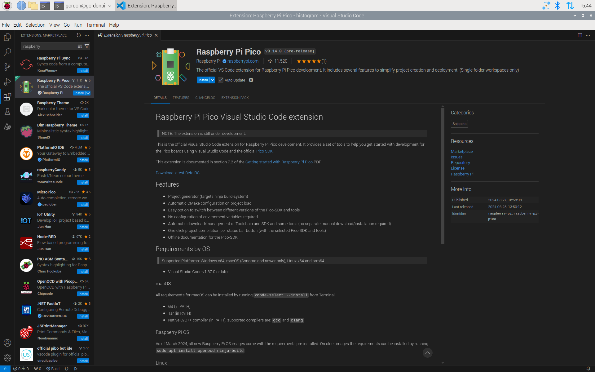
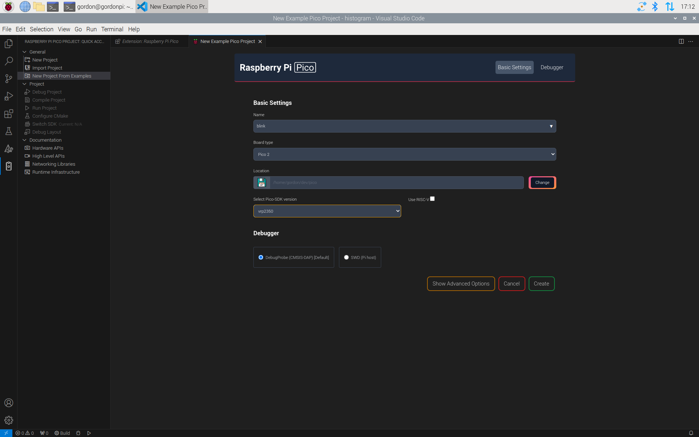
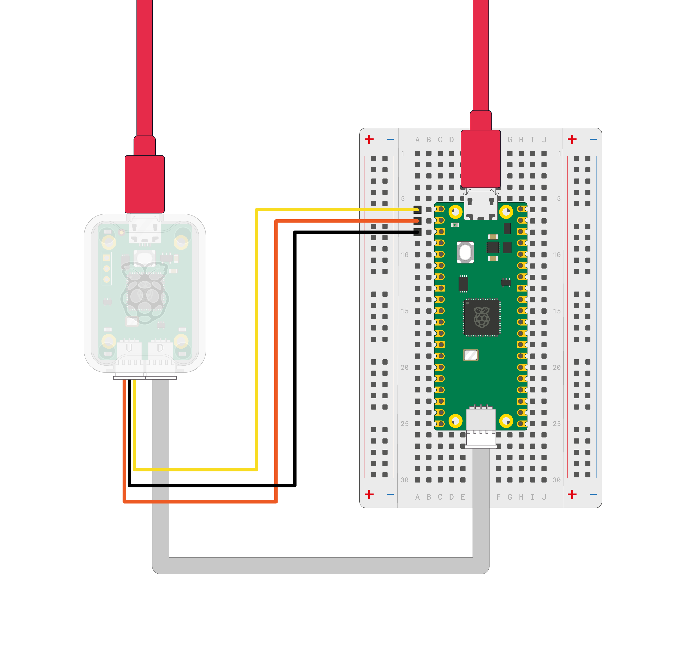
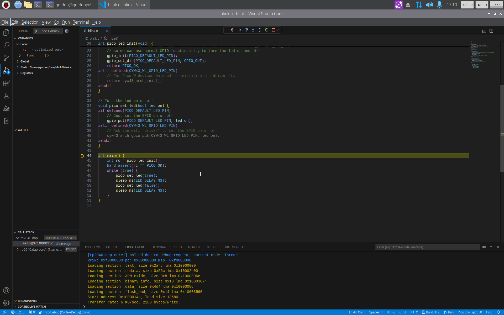
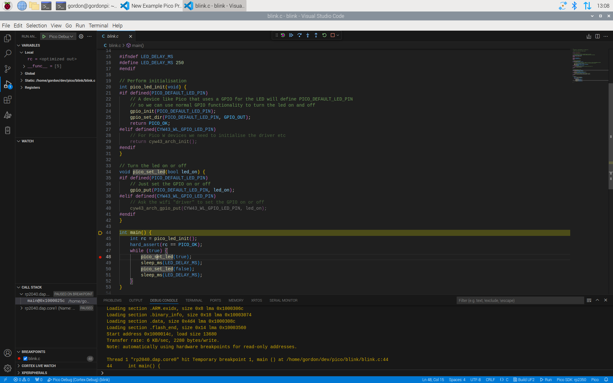
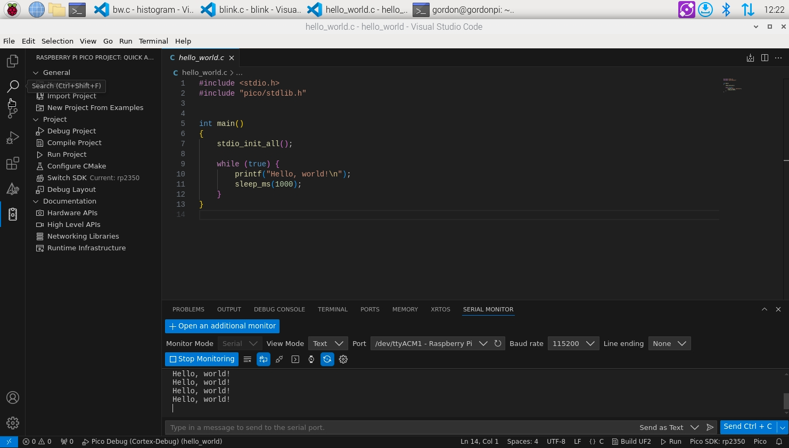
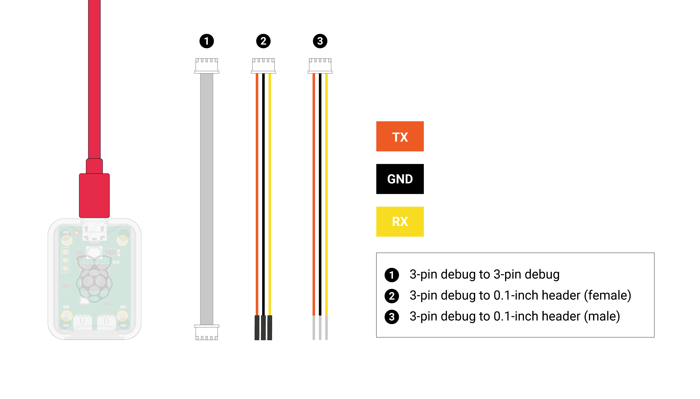
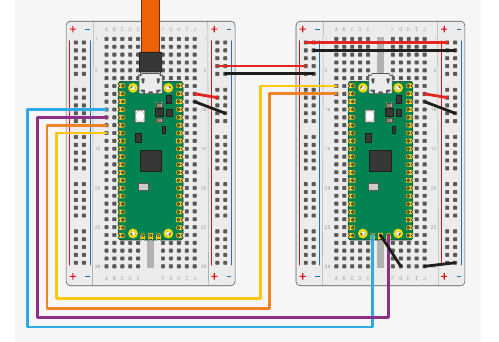
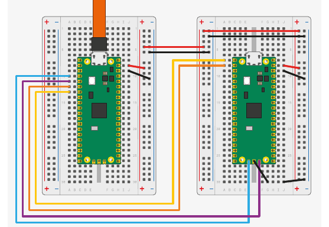

# Raspberry Pi Pico 系列入门指南

**C/C++ 开发：使用 Raspberry Pi Pico 系列及其他基于 Raspberry Pi 微控制器的开发板**

> **原文档**：*Getting Started with Raspberry Pi Pico-series*（RP-008276-DS-2）
> **发布版本**：24 ｜ **构建日期**：2026-07-03 ｜ **构建版本**：d4e0f1799616
> **版权**：© 2022-2026 Raspberry Pi Ltd，本文档采用 [Creative Commons Attribution-NoDerivatives 4.0 International (CC BY-ND)](https://creativecommons.org/licenses/by-nd/4.0/) 许可发布。
>
> **关于本译文**：本文是上述官方文档的中文翻译。根据需求，已省略 Windows/macOS 相关的安装与操作步骤，以及原文档附录 D（其他集成开发环境，如 CLion）和附录 E（文档修订历史）。原文档开头的法律免责声明属固定样板文本，此处从略。代码、命令及程序输出保持原文，不作翻译。

---

## 目录

1. [简介](#1-简介)
2. [安装 Visual Studio Code](#2-安装-visual-studio-code)
3. [安装 Raspberry Pi Pico VS Code 扩展](#3-安装-raspberry-pi-pico-vs-code-扩展)
   - [3.1 安装依赖](#31-安装依赖)
   - [3.2 安装扩展](#32-安装扩展)
4. [加载并调试项目](#4-加载并调试项目)
   - [4.1 编译并运行 blink](#41-编译并运行-blink)
   - [4.2 修改代码并重新运行](#42-修改代码并重新运行)
   - [4.3 调试](#43-调试)
5. [用 C 语言说 "Hello World"](#5-用-c-语言说-hello-world)
   - [5.1 Pico 系列设备上的串口输入输出](#51-pico-系列设备上的串口输入输出)
   - [5.2 创建项目](#52-创建项目)
   - [5.3 构建项目](#53-构建项目)
   - [5.4 查看控制台输出](#54-查看控制台输出)
- [附录 A. Debugprobe（调试探针）](#附录-a-debugprobe调试探针)
- [附录 B. Picotool](#附录-b-picotool)
- [附录 C. 命令行工具链配置](#附录-c-命令行工具链配置)

---

## 1. 简介

要跟着本指南操作，你需要准备以下物品：

- 一块 Raspberry Pi Pico 系列设备
- 一根 Micro USB 连接线

以下物品在后续的部分步骤中需要用到：

- Raspberry Pi Debug Probe，或者第二块 Raspberry Pi Pico 系列设备

接下来的说明假设你使用的是 Pico 系列设备；如果你使用其他基于 Raspberry Pi 微控制器的开发板，部分细节可能有所不同。

Pico 系列设备围绕 Raspberry Pi 设计的微控制器构建。官方同时提供 C/C++ SDK 与官方 MicroPython 移植版，对开发板上的开发工作提供完整支持。本书介绍如何上手 SDK，并带你完成 SDK 工具链的构建、安装和使用。

> **提示**
>
> 本书介绍的主要方法是使用 VS Code 扩展，让你的工作更轻松。如果你想改用命令行方式开发（例如在 Raspberry Pi OS Lite 上），请参阅[附录 C. 命令行工具链配置](#附录-c-命令行工具链配置)。

关于官方 MicroPython 移植版的更多信息，请参阅：

- Raspberry Pi Pico 系列 Python SDK 的文档（<https://pip.raspberrypi.com/documents/RP-008355-DS>）
- Raspberry Pi Press 出版的图书 *Get Started with MicroPython on Raspberry Pi Pico - 2nd Edition*（<https://magazine.raspberrypi.com/books/get-started-micropython-pico-2ed>）

关于 C/C++ SDK 的更多信息，请参阅 Raspberry Pi Pico 系列 C/C++ SDK 的文档（<https://pip.raspberrypi.com/documents/RP-009085-KB>）。

---

## 2. 安装 Visual Studio Code

Visual Studio Code（VS Code）是由 Microsoft 开发的一款流行的开源编辑器。Raspberry Pi Pico VS Code 扩展让安装依赖和为 Pico 系列设备构建软件变得非常简单。

> **提示**
>
> 如果你不想使用 VS Code，可以使用 [VSCodium](https://vscodium.com/)（社区驱动的自由开源替代品），或者手动配置你的环境。

在 Raspberry Pi OS 或 Linux 上安装 Visual Studio Code（VS Code），请运行以下命令：

```sh
$ sudo apt update
$ sudo apt install code
```

你也可以从 <https://code.visualstudio.com/Download> 下载安装包进行安装。

---

## 3. 安装 Raspberry Pi Pico VS Code 扩展

Raspberry Pi Pico VS Code 扩展帮助你在 Visual Studio Code 中创建、开发、运行和调试项目。它内置了项目生成器（支持多种模板选项）、工具链自动管理、一键编译项目，以及 Pico SDK 的离线文档。

该 VS Code 扩展支持所有 Raspberry Pi Pico 系列设备。

### 3.1 安装依赖

#### 3.1.1 Raspberry Pi OS

无需安装任何依赖。

> 原文此节为 "Raspberry Pi OS and Windows"，其中的 Windows 内容已按要求省略。

#### 3.1.2 Linux

大多数 Linux 发行版已预装运行该扩展所需的全部依赖。不过，某些发行版可能需要额外安装依赖。该扩展需要以下组件：

- Python 3.9 或更高版本
- Git
- Tar
- 〔可选〕gdb-multiarch，用于调试（仅 x86_64）
- 〔可选〕安装 [udev 规则](https://github.com/raspberrypi/openocd/blob/sdk-2.0.0/contrib/60-openocd.rules)，以便调试时无需 `sudo` 即可使用 OpenOCD
- 〔可选〕安装 [udev 规则](https://github.com/raspberrypi/picotool/blob/master/udev/)，以便加载程序时无需 `sudo` 即可使用 picotool
- 在 Ubuntu 22.04 上，需要安装 `libftdi1-2` 和 `libhidapi-hidraw0` 软件包才能使用 OpenOCD

你可以用以下命令安装这些依赖：

```sh
$ sudo apt install python3 git tar
```

> 原文中 macOS 的小节（3.1.3）已按要求省略。

### 3.2 安装扩展

你可以在 VS Code 扩展市场中找到该扩展。搜索 **Raspberry Pi Pico** 扩展（发布者为 Raspberry Pi），然后点击 **Install** 按钮将其添加到 VS Code。



商店页面：<https://marketplace.visualstudio.com/items?itemName=raspberry-pi.raspberry-pi-pico>

扩展的源代码和发行版下载地址：<https://github.com/raspberrypi/pico-vscode>

安装完成后，查看活动侧边栏（默认位于 VS Code 左侧）。如果安装成功，会出现一个新的侧边栏区域，带有一个 Raspberry Pi Pico 图标，标签为 "Raspberry Pi Pico Project"。

---

## 4. 加载并调试项目

VS Code 扩展可以基于 <https://github.com/raspberrypi/pico-examples> 提供的示例来创建项目。下面以创建一个让 Pico 系列设备上的 LED 闪烁的项目为例，带你走一遍整个流程：

1. 在 VS Code 左侧边栏中，选择 Raspberry Pi Pico 图标，其标签为 "Raspberry Pi Pico Project"。
2. 选择 **New Project from Examples**。
3. 在 **Name** 字段中，选择 `blink` 示例。
4. 选择与你的设备相匹配的开发板类型。
5. 指定一个文件夹，供扩展生成文件。VS Code 会在所选文件夹下新建一个子文件夹来存放新项目。
6. 点击 **Create** 创建项目。

扩展现在会下载 SDK 和工具链，将它们安装到本地，并生成新项目。第一个项目安装工具链可能需要 5–10 分钟。由于我们为你自动生成了 `.vscode` 目录，VS Code 会询问你是否信任该目录的作者。选择「是」。



> **注意**
>
> 此时 CMake Tools 扩展可能会显示一些通知。忽略并关闭它们即可。

现在，在 VS Code 左侧的资源管理器（Explorer）侧边栏中，你应该能看到一个文件列表。

打开 `blink.c`，即可在主窗口中查看 blink 示例的源代码。

Raspberry Pi Pico 扩展在屏幕右下角的状态栏中添加了一些功能：

**Compile（编译）**
　编译源代码并构建目标 UF2 文件。你可以把这个二进制文件复制到设备上完成烧录。

**Run（运行）**
　查找已连接的设备，把代码烧录进去并运行。

扩展侧边栏中也有一些快捷功能。点击侧边菜单中的 Pico 图标，你会看到 **Compile Project**。

点击 **Compile Project**，屏幕底部会打开一个终端标签页，显示编译进度。

### 4.1 编译并运行 blink

运行 blink 示例的步骤如下：

1. 按住 Pico 系列设备上的 BOOTSEL 按钮，同时用 Micro USB 线把设备连接到你的开发主机，以此强制设备进入 USB 大容量存储模式。
2. 按下状态栏中的 **Run** 按钮，或侧边栏中的 **Run project** 按钮。

你应该会看到窗口底部的终端标签页打开，显示代码上传的相关信息。代码上传完成后，设备会重启，你应该会看到以下输出：

```text
The device was rebooted to start the application.
```

你的 blink 代码现在开始运行了。观察设备，LED 应该每秒闪烁两次。

### 4.2 修改代码并重新运行

为了确认一切工作正常，在 VS Code 中点击 `blink.c` 文件。找到代码顶部 `LED_DELAY_MS` 的定义处：

```c
#ifndef LED_DELAY_MS
#define LED_DELAY_MS 250
#endif LED_DELAY_MS
```

1. 把 250ms（四分之一秒）改为 100（十分之一秒）：

   ```c
   #ifndef LED_DELAY_MS
   #define LED_DELAY_MS 100
   #endif LED_DELAY_MS
   ```

2. 断开设备连接，然后按住 BOOTSEL 按钮重新连接。
3. 按下状态栏中的 **Run** 按钮，或侧边栏中的 **Run project** 按钮。

你应该会看到窗口底部的终端标签页打开，显示代码上传的相关信息。代码上传完成后，设备会重启，你应该会看到以下输出：

```text
The device was rebooted to start the application.
```

你的 blink 代码现在开始运行了。观察设备，LED 应该闪得更快，每秒闪烁五次。

### 4.3 调试

Raspberry Pi Debug Probe 是适用于任何基于 Arm 的计算机的调试解决方案。你也可以使用其他调试硬件配合 Pico 系列设备，但我们推荐使用 Debug Probe，因为它的配置最为简单。如果你想用一块 Pico 系列设备充当 Debug Probe，请参阅[附录 A.2 用第二块 Pico 或 Pico 2 进行调试](#a2-用第二块-pico-或-pico-2-进行调试)。

首先，通过开发板上的调试接口把 Debug Probe 连接到你的 Pico 系列设备。不同的 Pico 设备需要不同的连接器。对于 Pico、Pico W 和 Pico 2，需要用烙铁把 Debug Probe 连接器焊接到开发板上；对于 Pico H、Pico WH 以及带排针的 Pico，调试排针已经焊好，直接用附带的线缆连接 Debug Probe 即可。



更多信息请参阅 Debug Probe 文档。

现在，把 Debug Probe 的 USB 插入你的计算机。注意 Debug Probe 不会给 Pico 设备供电，Pico 必须单独供电。

启动调试器的步骤：

1. 点击 Pico 图标打开扩展侧边栏。
2. 选择 **Debug Project**，或按 `F5`。
3. 如果提示选择调试器，请选择 **Pico Debug (Cortex-Debug)**。

调试器会自动把代码下载到设备，在你的 `main` 函数开头插入一个断点，并运行到该断点处停下。



进入调试模式后，侧边栏中会出现若干窗口，显示设备当前状态的有用信息。顶部有一条小的控制栏，其中的按钮用于控制代码执行。把鼠标悬停在按钮上可以查看它们的名称。要继续执行代码，点击 **Continue**（`F5`）。

你的 blink 代码现在正在运行。观察设备，LED 应该像之前一样闪烁。现在按 **Restart**（`Ctrl+Shift+F5`）回到 `main` 函数的开头。

按一次 **Step-over**（`F10`）。高亮显示的行（表示下一条将要执行的语句）会前进到 `pico_led_init` 函数调用处。要步入这个函数，按 **Step-into**（`F11`）。源代码窗口会更新，显示执行位置现在位于该函数的开头。你可以继续单步执行代码直到函数返回 `main`，也可以按 **Step-out**（`Shift+F11`）直接执行完该函数。

返回 `main` 函数后，查看 **Local Variables**（局部变量）窗口，可以看到 `rc` 的值为 `0`（`PICO_OK`）。

再次按 **Restart**（`Ctrl+Shift+F5`）回到 `main` 函数开头。然后把光标移到 `pico_set_led` 那一行，按 `F9`。创建断点后，你会看到一个红点标示断点的位置：



点击红点即可添加或移除断点。

按 **Continue**（`F5`），执行应该会停在断点处。接着按 **Step-over**（`F10`），你应该会看到 LED 亮起。

---

## 5. 用 C 语言说 "Hello World"

在让 LED 点亮和熄灭之后，大多数开发者接下来想做的事就是创建并使用串口，然后说一句 "Hello World"。

### 5.1 Pico 系列设备上的串口输入输出

串口输入（`stdin`）和输出（`stdout`）可以被定向到串口 UART 和/或 USB CDC（USB 串口）。

使用串口 UART 控制台时，输入和输出通过设备上的 UART 引脚传输——默认使用 Pin 1（`GP0`）发送输出（`UART0_TX`），使用 Pin 2（`GP1`）接收输入（`UART0_RX`）。你需要把 Pico 系列设备上的 UART 引脚连接到一个 UART 转 USB 转换器（例如 Debug Probe），如 Debug Probe 接线图所示。

使用 USB CDC 控制台时，输入和输出直接通过连接到你计算机的 USB 线传输，因此不需要额外接线。不过在代码开始运行时，你可能会漏掉一部分打印内容，因为设备重启后，你的计算机可能需要一两秒钟才能连接到 Pico 系列设备。

使用扩展时，你可以根据自己的偏好选择其中一种控制台，或同时使用两种。

### 5.2 创建项目

> **注意**
>
> Pico SDK 使用 CMake 来管理其构建系统。如果你不想使用 VS Code 扩展，请参阅[附录 C.2 手动创建你自己的项目](#c2-手动创建你自己的项目)。

1. 在 VS Code 左侧边栏中，选择 Raspberry Pi Pico 图标，其标签为 "Raspberry Pi Pico Project"。
2. 选择 **New Project**。
3. 在 **Name** 字段中为项目命名，例如 "hello_world"。
4. 选择与你的设备相匹配的开发板类型。
5. 指定一个文件夹，供扩展生成文件。VS Code 会在所选文件夹下新建一个子文件夹来存放新项目。
6. 在 "STDIO support" 下，选择你想要的控制台。
7. 点击 **Create** 创建项目。

扩展现在会生成新项目。由于我们为你自动生成了 `.vscode` 目录，VS Code 会询问你是否信任该目录的作者。选择「是」。

### 5.3 构建项目

运行 "Hello world" 示例的步骤如下：

1. 按住 Pico 系列设备上的 BOOTSEL 按钮，同时用 Micro USB 线把设备连接到你的开发主机，以此强制设备进入 USB 大容量存储模式。
2. 按下状态栏中的 **Run** 按钮，或侧边栏中的 **Run project** 按钮。

你应该会看到窗口底部的终端标签页打开，显示代码上传的相关信息。代码上传完成后，设备会重启，你应该会看到以下输出：

```text
The device was rebooted to start the application.
```

你的 "Hello world" 代码现在开始运行了。

不过，虽然 "Hello World" 示例已经在运行，我们暂时还看不到输出的文本。

### 5.4 查看控制台输出

如果你使用的是 STDIO UART，请先确认已经完成接线。STDIO USB 除了连接到计算机之外不需要任何其他接线。

在 VS Code 中，打开 **View** 菜单，选择 **Terminal** 打开底部面板。在该面板中，你会找到 **Serial Monitor** 标签页。选择串口——可能不止一个。波特率应为 `115200`。选择 **Start Monitoring** 即可看到输出。



---

## 附录 A. Debugprobe（调试探针）

Raspberry Pi 提供两种调试 Pico 系列设备的方式：

- Raspberry Pi Debug Probe
- 在第二块 Pico 或 Pico 2 上运行 debugprobe 固件

两种方式都可以在包括 Windows、macOS 和 Linux 在内的平台上调试 Pico 系列设备。作为调试器的设备通过 USB 连接到你的常用计算机，并通过 SWD 和 UART 连接到目标 Pico。

### A.1 Debug Probe

调试 Pico 系列设备最简单的方法是使用 [Raspberry Pi Debug Probe](https://www.raspberrypi.com/products/debug-probe/)。Raspberry Pi Debug Probe 提供串行线调试（SWD）以及一个通用的 USB 转串口桥。

> **注意**
>
> 关于 Debug Probe 的更多信息，请参阅[官方文档站点](https://www.raspberrypi.com/documentation/microcontrollers/debug-probe.html)。

#### A.1.1 Debug Probe 接线




要把 Debug Probe 连接到 Pico H，请连接以下线路：

- Debug Probe 的 "D" 端口 → Pico H 的 "DEBUG" SWD JST-SH 连接器
- Debug Probe 的 "U" 端口，使用三针 JST-SH 转 0.1 英寸排针（公头）的线缆：
  - Debug Probe RX → Pico H TX 引脚
  - Debug Probe TX → Pico H RX 引脚
  - Debug Probe GND → Pico H GND 引脚

然后连接两根 USB 线：一根从你的计算机连接到 Debug Probe 的 microUSB 端口，另一根从你的计算机连接到 Pico 的 microUSB 端口。

> **注意**
>
> 如果你用的是非 H 版的 Pico、Pico 2 或 Pico W（没有 JST-SH 连接器），仍然可以把它连接到 Debug Probe。把公头连接器焊接到开发板上的 `SWCLK`、`GND` 和 `SWDIO` 排针上。使用 Debug Probe 附带的另一根三针 JST-SH 转 0.1 英寸排针（母头）线缆，连接到 Debug Probe 的 "D" 端口。把 Pico 或 Pico W 上的 `SWCLK`、`GND` 和 `SWDIO` 分别连接到 Debug Probe 上的 `SC`、`GND` 和 `SD` 引脚。

Pico 与 Debug Probe 之间的线束连接如图 8 所示。

### A.2 用第二块 Pico 或 Pico 2 进行调试

一块 Pico 或 Pico 2 可以使用 debugprobe 固件来为另一块重新烧录和调试，该固件把 Pico 或 Pico 2 变成一个 USB → SWD 与 UART 桥。



#### A.2.1 安装 debugprobe

你可以从 GitHub 上 [debugprobe 的最新发行版](https://github.com/raspberrypi/debugprobe/releases/latest)下载 debugprobe 的 UF2 二进制文件。

按住 BOOTSEL 按钮启动作为调试器的 Pico 或 Pico 2，把 `debugprobe_on_pico.uf2` 复制到设备上即可开始调试。

> **注意**
>
> 使用 `debugprobe_on_pico.uf2` 可以把 Pico 用作调试器；使用 `debugprobe_on_pico2.uf2` 用于 Pico 2。Debug Probe 配件硬件请使用 `debugprobe.uf2`。

### A.3 debugprobe 接线



两块 Pico 开发板之间的线束连接如图 10 所示。

```text
Pico A GND -> Pico B GND
Pico A GP2 -> Pico B SWCLK
Pico A GP3 -> Pico B SWDIO
Pico A GP4/UART1 TX -> Pico B GP1/UART0 RX
Pico A GP5/UART1 RX -> Pico B GP0/UART0 TX
```

通过 OpenOCD 加载和运行代码所需的最少连接是 `GND`、`SWCLK` 和 `SWDIO`。连接 UART 线，即可通过 Pico A 的 USB 连接与 Pico B 的 UART 串口通信。你也可以用这些 UART 线与任何其他 UART 串口设备通信，例如 Raspberry Pi 上的启动控制台。

要用 Pico B 给 Pico A 供电，请连接以下引脚：

- 当 USB 工作在设备模式或完全不使用时，连接 `VSYS` 到 `VSYS`
- 当作为 USB 主机使用时，连接 `VBUS` 到 `VBUS`，以便在 USB 连接器上提供 5V 电压

### A.4 Debug Probe 接口

Debug Probe 以及任何运行 debugprobe 的 Pico 系列设备都是复合设备，具有两个 USB 接口：

1. 一个符合类规范的 CDC UART（串口），因此在 Windows 上开箱即用。
2. 一个厂商自定义接口，用于传输符合 CMSIS-DAP v2 规范的 SWD 探针数据。

### A.5 使用 UART

#### A.5.1 Linux

在 Linux 上使用 UART 连接，请运行以下命令：

```sh
$ sudo minicom -D /dev/ttyACM0 -b 115200
```

> 原文中的 A.5.2（Windows）与 A.5.3（macOS）小节已按要求省略。

### A.6 使用 OpenOCD 调试

#### A.6.1 获取 OpenOCD

支持所有 Pico 系列设备的 OpenOCD 二进制发行版可以从 GitHub 上的 [Pico SDK tools 仓库](https://github.com/raspberrypi/pico-sdk-tools)获取。你也可以用以下命令自行构建并安装：

```sh
$ git clone https://github.com/raspberrypi/openocd.git --branch sdk-2.2.0
$ cd openocd
$ ./bootstrap
$ ./configure --disable-werror
$ make -j4
$ sudo make install
```

有了 Debug Probe，你就可以通过 SWD 端口和 OpenOCD 来加载二进制文件。

首先构建一个二进制文件。然后运行以下命令把该二进制文件上传到 Pico，其中把 `blink.elf` 替换为你刚构建的 ELF 文件名：

```sh
$ sudo openocd -f interface/cmsis-dap.cfg -f target/rp2040.cfg -c "adapter speed 5000" -c "program blink.elf verify reset exit"
```

如果你使用的是基于 RP2350 的开发板，则使用：

```sh
$ sudo openocd -f interface/cmsis-dap.cfg -f target/rp2350.cfg -c "adapter speed 5000" -c "program blink.elf verify reset exit"
```

#### A.6.2 使用 SWD 调试

你也可以让 OpenOCD 运行在服务器模式下，并连接一个能够提供断点等功能的调试器。

> **重要**
>
> 为了让调试更容易，你可以使用 `CMAKE_BUILD_TYPE` 选项以 Debug 构建类型来构建二进制文件：
>
> ```sh
> $ cd ~/pico/pico-examples/
> $ cmake -S . -B build -DCMAKE_BUILD_TYPE=Debug -DPICO_BOARD=pico
> $ cmake --build build
> ```
>
> 注意：对于 Raspberry Pi Pico 2，应使用 `-DPICO_BOARD=pico2`。
>
> Debug 构建进行的优化较少，这使得在调试器中运行时更容易看清程序的执行过程。

首先，运行一个 OpenOCD 服务器：

```sh
$ sudo openocd -f interface/cmsis-dap.cfg -f target/rp2040.cfg -c "adapter speed 5000"
```

对于基于 RP2350 的设备，请改用 `-f target/rp2350.cfg`。

然后打开第二个终端窗口，启动调试器并把你的二进制文件作为参数传入：

```sh
$ gdb blink.elf
> target remote localhost:3333
> monitor reset init
> load
> continue
```

GDB 并非在所有平台上都可用。请根据你的操作系统和设备，改用以下替代方案之一来代替 `gdb`：

- 在非 Raspberry Pi 的 Linux 设备上，使用 `gdb-multiarch`。
- 在基于 Arm 的 macOS 设备上，使用 `lldb`。

#### A.6.3 Rescue Debug Port（救援调试端口）

如果用户往 flash 中烧录了一些有问题的代码，可以使用 RP2040 或 RP2350 上的救援调试端口（Rescue DP）把芯片复位到已知状态。例如，关闭了系统时钟的代码会导致处理器调试端口无法访问，但救援 DP 仍然可用，因为它由 SWD 接口的 SWCLK 提供时钟。一次成功的救援 DP 操作会复位芯片，并在启动流程早期暂停 bootrom。

##### A.6.3.1 从 OpenOCD 激活 Rescue DP

提供了两个用于访问救援 DP 的目标配置：

- `rp2040-rescue.cfg`
- `rp2350-rescue.cfg`

使用与你目标设备相对应的配置文件启动 OpenOCD。

```sh
$ openocd -f interface/cmsis-dap.cfg -f target/rp2040-rescue.cfg
...
Warn : gdb services need one or more targets defined
Now attach a debugger to your RP2040 and load some code
Info : Listening on port 6666 for tcl connections
Info : Listening on port 4444 for telnet connections
```

按 `Ctrl + C` 停止。

现在用普通配置启动 OpenOCD。

```sh
$ openocd -f interface/cmsis-dap.cfg -f target/rp2040.cfg
```

> **注意**
>
> 在 RP2350 上，`CRIT1.DEBUG_DISABLE` 和 `CRIT1.SECURE_DEBUG_DISABLE` 这两个 OTP 标志（或设置了调试密钥索引）所带来的效果，无法通过救援 DP 复位来解除。

---

## 附录 B. Picotool

你可以把信息嵌入到 Pico 系列的二进制文件中，这些信息可以通过一个名为 `picotool` 的命令行工具读取出来。

### B.1 获取 picotool

`picotool` 工具位于它自己的仓库中。如果你没有使用 VS Code 扩展，或者没有运行过 `pico-setup` 脚本，那么你需要下载预编译的二进制文件，或者自行构建——两种方式的详细说明都可以在 [picotool README.md](https://github.com/raspberrypi/picotool#readme) 中找到。

### B.2 使用 picotool

`picotool` 二进制文件内置了命令行帮助功能，会列出所有可用命令：

```text
$ picotool help
PICOTOOL:
    Tool for interacting with RP-series device(s) in BOOTSEL mode, or with an RP-series binary


SYNOPSIS:
    picotool info [-b] [-m] [-p] [-d] [--debug] [-l] [-a] [device-selection]
    picotool info [-b] [-m] [-p] [-d] [--debug] [-l] [-a] <filename> [-t <type>]
    picotool config [-s <key> <value>] [-g <group>] [device-selection]
    picotool config [-s <key> <value>] [-g <group>] <filename> [-t <type>]
    picotool load [--ignore-partitions] [--family <family_id>] [-p <partition>] [-n] [-N] [-u]
                  [-v] [-x] <filename> [-t <type>] [-o <offset>] [device-selection]
    picotool encrypt [--quiet] [--verbose] [--embed] [--fast-rosc] [--use-mbedtls]
                  [--otp-key-page <page>] [--hash] [--sign] <infile> [-t <type>] [-o <offset>]
                  <outfile> [-t <type>] <aes_key> <iv_salt> <signing_key> <otp>
    picotool seal [--quiet] [--verbose] [--hash] [--sign] [--clear] <infile> [-t <type>] [-o
                  <offset>] <outfile> [-t <type>] <key> <otp> [--major <major>] [--minor <minor>]
                  [--rollback <rollback> [<rows>..]]
    picotool link [--quiet] [--verbose] <outfile> [-t <type>] <infile1> [-t <type>] <infile2>
                  [-t <type>] [<infile3>] [-t <type>] [-p <pad>]
    picotool save [-p] [-v] [--family <family_id>] <filename> [-t <type>] [device-selection]
    picotool save -a [-v] [--family <family_id>] <filename> [-t <type>] [device-selection]
    picotool save -r <from> <to> [-v] [--family <family_id>] <filename> [-t <type>]
                  [device-selection]
    picotool erase [-a] [device-selection]
    picotool erase -p <partition> [device-selection]
    picotool erase -r <from> <to> [device-selection]
    picotool verify <filename> [-t <type>] [device-selection] [-r <from> <to>] [-o <offset>]
                  [device-selection]
    picotool reboot [-a] [-u] [-g <partition>] [-c <cpu>] [device-selection]
    picotool otp list|get|set|load|dump|permissions|white-label
    picotool partition info|create
    picotool uf2 info|convert
    picotool version [-s] [<version>]
    picotool coprodis [--quiet] [--verbose] <infile> <outfile>
    picotool help [<cmd>]


COMMANDS:
    info          Display information from the target device(s) or file.
                  Without any arguments, this will display basic information for all connected
                  RP-series devices in BOOTSEL mode
    config        Display or change program configuration settings from the target device(s) or
                  file.
    load          Load the program / memory range stored in a file onto the device.
    encrypt       Encrypt the program.
    seal          Add final metadata to a binary, optionally including a hash and/or signature.
    link          Link multiple binaries into one block loop.
    save          Save the program / memory stored in flash on the device to a file.
    erase         Erase the program / memory stored in flash on the device.
    verify        Check that the device contents match those in the file.
    reboot        Reboot the device
    otp           Commands related to the RP2350 OTP (One-Time-Programmable) Memory
    partition     Commands related to RP2350 Partition Tables
    uf2           Commands related to UF2 creation and status
    version       Display picotool version
    coprodis      Post-process coprocessor instructions in disassembly files.
    help          Show general help or help for a specific command


Use "picotool help <cmd>" for more info
```

> **注意**
>
> 大多数命令都需要连接一台处于 BOOTSEL 模式的 Raspberry Pi 微控制器设备。

> **重要**
>
> 如果你收到错误信息 `No accessible RP2040/RP2350 devices in BOOTSEL mode were found.`，并伴有类似 `Device at bus 1, address 7 appears to be a RP2040 device in BOOTSEL mode, but picotool was unable to connect` 的提示——这表明确实连接了一台 Pico 系列设备——那么你可以用 `sudo` 运行 picotool，例如：
>
> ```sh
> $ sudo picotool info -a
> ```
>
> 原文此处还包含一条针对 Windows 上 RP2040 需要安装驱动（Zadig/WinUSB）的说明，按需求已省略。

从 picotool 1.1 版本开始，你还可以与不在 BOOTSEL 模式、但使用了 Pico SDK 的 USB stdio 支持的 Raspberry Pi 微控制器交互，方法是使用 picotool 的 `-f` 参数。

#### B.2.1 显示信息

SDK 现在支持 Binary Information（二进制信息），可以方便地存储供 picotool 查找的紧凑信息（见下文 [B.2.3 二进制信息](#b23-二进制信息)）。`info` 命令就是用来读取这些信息的。

这些信息可以从一台或多台处于 BOOTSEL 模式的已连接 Raspberry Pi 微控制器上读取，也可以从文件中读取。文件可以是 ELF、UF2 或 BIN 文件。

```text
$ picotool help info
INFO:
    Display information from the target device(s) or file.
    Without any arguments, this will display basic information for all connected RP-series
    devices in BOOTSEL mode


SYNOPSIS:
    picotool info [-b] [-m] [-p] [-d] [--debug] [-l] [-a] [device-selection]
    picotool info [-b] [-m] [-p] [-d] [--debug] [-l] [-a] <filename> [-t <type>]


OPTIONS:
    Information to display
        -b, --basic
            Include basic information. This is the default
        -m, --metadata
            Include all metadata blocks
        -p, --pins
            Include pin information
        -d, --device
            Include device information
        --debug
            Include device debug information
        -l, --build
            Include build attributes
        -a, --all
            Include all information


TARGET SELECTION:
    To target one or more connected RP-series device(s) in BOOTSEL mode (the default)
        --bus <bus>
            Filter devices by USB bus number
        --address <addr>
            Filter devices by USB device address
        --vid <vid>
            Filter by vendor id
        --pid <pid>
            Filter by product id
        --ser <ser>
            Filter by serial number
        -f, --force
            Force a device not in BOOTSEL mode but running compatible code to reset so the
            command can be executed. After executing the command (unless the command itself is a
            'reboot') the device will be rebooted back to application mode
        -F, --force-no-reboot
            Force a device not in BOOTSEL mode but running compatible code to reset so the
            command can be executed. After executing the command (unless the command itself is a
            'reboot') the device will be left connected and accessible to picotool, but without
            the USB drive mounted
    To target a file
        <filename>
            The file name
        -t <type>
            Specify file type (uf2 | elf | bin) explicitly, ignoring file extension
```

例如，先按住 BOOTSEL 按钮再插入 USB，把你的 Pico 系列设备以大容量存储模式连接到计算机。然后打开终端窗口，输入：

```text
$ sudo picotool info
Program Information
 name:          hello_world
 features:      stdout to UART
```

或者：

```text
$ sudo picotool info -a
Program Information
 name:                hello_world
 features:            stdout to UART
 binary start:        0x10000000
 binary end:          0x1000606c


Fixed Pin Information
 20:   UART1 TX
 21:   UART1 RX


Build Information
 build date:              Dec 31 2020
 build attributes:        Debug build


Device Information
 flash size:       2048K
 ROM version:         2
```

想了解更多信息，或者你也可以只查看所用引脚的信息：

```text
$ sudo picotool info -bp
Program Information
 name:           hello_world
 features:       stdout to UART


Fixed Pin Information
 20:    UART1 TX
 21:    UART1 RX
```

该工具也可以用于仍在你本地文件系统中的二进制文件：

```text
$ picotool info -a lcd_1602_i2c.uf2
File lcd_1602_i2c.uf2:


Program Information
 name:                 lcd_1602_i2c
 web site:             https://github.com/raspberrypi/pico-examples/tree/HEAD/i2c/lcd_1602_i2c
 binary start:         0x10000000
 binary end:           0x10003c1c


Fixed Pin Information
 4:    I2C0 SDA
 5:    I2C0 SCL


Build Information
 build date:        Dec 31 2020
```

#### B.2.2 保存程序

`save` 允许你把设备上的一段内存、某个程序或整个 flash 保存为 BIN 文件或 UF2 文件。

```text
$ picotool help save
SAVE:
    Save the program / memory stored in flash on the device to a file.


SYNOPSIS:
    picotool save [-p] [-v] [--family <family_id>] <filename> [-t <type>] [device-selection]
    picotool save -a [-v] [--family <family_id>] <filename> [-t <type>] [device-selection]
    picotool save -r <from> <to> [-v] [--family <family_id>] <filename> [-t <type>]
                     [device-selection]


OPTIONS:
    Selection of data to save
        -p, --program
            Save the installed program only. This is the default
        -a, --all
            Save all of flash memory
        -r, --range
            Save a range of memory. Note that UF2s always store complete 256 byte-aligned blocks
            of 256 bytes, and the range is expanded accordingly
        <from>
            The lower address bound in hex
        <to>
            The upper address bound in hex
    Other
        -v, --verify
            Verify the data was saved correctly
        --family
            Specify the family ID to save the file as
        <family_id>
            family ID to save file as
    File to save to
        <filename>
            The file name
        -t <type>
            Specify file type (uf2 | elf | bin) explicitly, ignoring file extension
    Source device selection
        --bus <bus>
            Filter devices by USB bus number
        --address <addr>
            Filter devices by USB device address
        --vid <vid>
            Filter by vendor id
        --pid <pid>
            Filter by product id
        --ser <ser>
            Filter by serial number
        -f, --force
            Force a device not in BOOTSEL mode but running compatible code to reset so the
            command can be executed. After executing the command (unless the command itself is a
            'reboot') the device will be rebooted back to application mode
        -F, --force-no-reboot
            Force a device not in BOOTSEL mode but running compatible code to reset so the
            command can be executed. After executing the command (unless the command itself is a
            'reboot') the device will be left connected and accessible to picotool, but without
            the USB drive mounted
```

例如：

```text
$ sudo picotool info
Program Information
name:         lcd_1602_i2c
web site:     https://github.com/raspberrypi/pico-examples/tree/HEAD/i2c/lcd_1602_i2c
$ picotool save spoon.uf2
Saving file: [==============================]      100%
Wrote 51200 bytes to spoon.uf2
$ picotool info spoon.uf2
File spoon.uf2:
Program Information
name:         lcd_1602_i2c
web site:     https://github.com/raspberrypi/pico-examples/tree/HEAD/i2c/lcd_1602_i2c
```

#### B.2.3 二进制信息

二进制信息（Binary Information）是在构建时嵌入到二进制文件中的、机器可定位且机器可读的信息。

#### B.2.4 基本信息

当你拿到一块 Pico 系列设备却不知道里面烧了什么程序时，这些信息非常有用！

基本信息包括：

- 程序名称
- 程序描述
- 程序版本字符串
- 程序构建日期
- 程序 URL
- 程序结束地址
- 程序功能特性（program features）：这是由二进制文件中的各个字符串构成的列表，可以显示出来（例如 SDK 中会有一个用于 UART stdio、一个用于 USB stdio）
- 构建属性（build attributes）：这是一个类似的字符串列表，用于描述与二进制文件本身相关的内容（例如 Debug Build）

#### B.2.5 引脚

当你手头有个可执行文件 `hello_serial.elf`，却忘了它是为哪块基于 Raspberry Pi 微控制器的开发板构建的时候，这个功能就非常方便了——因为不同的开发板引出的引脚可能不同。

静态（固定）引脚分配可以以非常紧凑的形式记录在二进制文件中：

```text
$ picotool info --pins sprite_demo.elf
File sprite_demo.elf:


Fixed Pin Information
0-4:         Red 0-4
6-10:        Green 0-4
11-15:       Blue 0-4
16:          HSync
17:          VSync
18:          Display Enable
19:          Pixel Clock
20:          UART1 TX
21:          UART1 RX
```

#### B.2.6 完整信息

使用 `-a` 选项可以显示完整信息：

```text
$ picotool info -a i2c_bus_scan.elf
File i2c_bus_scan.elf:


Program Information
 name:                 i2c_bus_scan
 web site:             https://github.com/raspberrypi/pico-examples/tree/HEAD/i2c/bus_scan
 features:             UART stdin / stdout
 binary start:         0x10000000
 binary end:           0x10004c74


Fixed Pin Information
 0:     UART0 TX
 1:     UART0 RX
 4:     I2C0 SDA
 5:     I2C0 SCL


Build Information
 sdk version:              2.0.0-develop
 pico_board:               pico
 build date:               Aug    1 2024
 build attributes:         Debug
```

---

## 附录 C. 命令行工具链配置

### C.1 通过脚本配置环境

如果你在运行 Raspberry Pi OS 的 Raspberry Pi 上为 Pico 系列设备开发，那么可以使用 `pico_setup.sh` 脚本来搭建命令行环境。

该脚本会自动完成以下配置工作：

- 在你运行 `pico_setup.sh` 脚本的文件夹中创建一个名为 `pico` 的目录
- 安装所需的依赖
- 下载 `pico-sdk`、`pico-examples`、`pico-extras` 和 `pico-playground` 仓库
- 在你的 `~/.bashrc` 中定义 `PICO_SDK_PATH`、`PICO_EXAMPLES_PATH`、`PICO_EXTRAS_PATH` 和 `PICO_PLAYGROUND_PATH`
- 下载、构建并安装 picotool（参见[附录 B. Picotool](#附录-b-picotool)）
- 下载并构建 debugprobe（参见[附录 A. Debugprobe](#附录-a-debugprobe调试探针)）
- 构建 `blink` 和 `hello_world` 示例项目
- 下载并编译 OpenOCD（用于调试支持）
- 配置你的开发用 Raspberry Pi 的 UART，使其可与 Pico 系列设备配合使用

`pico_setup.sh` 的 [README.md](https://github.com/raspberrypi/pico-setup/blob/master/README.md) 中还包含如何在命令行下为 Pico 系列设备构建、加载和调试程序的说明。

> **提示**
>
> 该配置脚本需要约 4 GB 的 SD 卡磁盘空间，因此运行前请确认有足够的可用空间。你可以用 `df -h` 命令查看剩余磁盘空间。

首先运行以下命令安装 `wget`：

```sh
$ sudo apt install wget
```

```sh
$ wget https://raw.githubusercontent.com/raspberrypi/pico-setup/master/pico_setup.sh
```

然后用 `chmod` 把脚本标记为可执行：

```sh
$ chmod +x pico_setup.sh
```

用以下命令运行该脚本：

```sh
$ ./pico_setup.sh
```

最后，重启你的 Raspberry Pi 以加载 UART 配置的改动：

```sh
$ sudo reboot
```

#### C.1.1 手动配置环境

关于手动配置环境的详细信息，请参阅 `pico_setup.sh` 的 README.md。

#### C.1.2 更新 Pico SDK

当新版本的 Pico SDK 发布后，你必须更新本地的 SDK 副本，并且建议删除所有本地构建目录。更新时，进入 `pico-sdk` 目录并运行以下命令（对于 `pico-examples` 也应做同样的操作）：

```sh
$ cd pico-sdk
$ git pull
$ git submodule update
```

你还需要更新本地的 picotool 副本，并重新构建和安装它——进入 `picotool` 目录并运行以下命令：

```sh
$ cd picotool
$ git pull
$ cmake --build build
$ sudo cmake --install build
```

> **注意**
>
> 如果想及时获知新版本发布，可以在 pico-sdk 的 GitHub 仓库上设置自定义关注（watch）。仓库地址：<https://github.com/raspberrypi/pico-sdk>

### C.2 手动创建你自己的项目

先创建一个目录来存放你的测试项目，让它与 `pico-sdk` 目录并列：

```sh
$ cd ~/pico
$ ls -la
total 16
drwxr-xr-x        7 aa   staff   224   6 Apr 10:41 ./
drwx------@ 27 aa        staff   864   6 Apr 10:41 ../
drwxr-xr-x      10 aa        staff   320   6 Apr 09:29 pico-examples/
drwxr-xr-x      13 aa        staff   416   6 Apr 09:22 pico-sdk/
$ mkdir test
$ cd test
```

然后在该目录中创建一个 `test.c` 文件：

```c
#include <stdio.h>
#include "pico/stdlib.h"
#include "hardware/gpio.h"
#include "pico/binary_info.h"


const uint LED_PIN = 25;<1>


int main() {


    bi_decl(bi_program_description("This is a test binary."));<2>
    bi_decl(bi_1pin_with_name(LED_PIN, "On-board LED"));


    stdio_init_all();


    gpio_init(LED_PIN);
    gpio_set_dir(LED_PIN, GPIO_OUT);
    while (1) {
           gpio_put(LED_PIN, 0);
           sleep_ms(250);
           gpio_put(LED_PIN, 1);
           puts("Hello World\n");
           sleep_ms(1000);
    }
}
```

在 Pico 和 Pico 2 上，板载 LED 连接到 `GP25`；如果你是为 Pico W 构建，LED 连接到 `CYW43_WL_GPIO_LED_PIN`。更多信息请参阅 pico-examples GitHub 仓库中的 Pico W blink 示例。上面 `<1>`、`<2>` 标记的这些行会往二进制文件中添加字符串，可用 picotool 查看，参见[附录 B. Picotool](#附录-b-picotool)。

再创建一个 `CMakeLists.txt` 文件：

```cmake
cmake_minimum_required(VERSION 3.13)


include(pico_sdk_import.cmake)


project(test_project C CXX ASM)
set(CMAKE_C_STANDARD 11)
set(CMAKE_CXX_STANDARD 17)
pico_sdk_init()


add_executable(test
       test.c
)


target_link_libraries(test pico_stdlib)


pico_enable_stdio_usb(test 1)<1>
pico_enable_stdio_uart(test 1)<2>


pico_add_extra_outputs(test)
```

- `<1>` 启用通过 USB 的串口输出。这会创建一个 USB CDC 接口，以支持通过 USB 串口（CDC）进行 stdin/stdout 通信。
- `<2>` 启用通过 UART 的串口输出。这会添加对开发板上默认 UART 引脚（Pico 系列设备为 GPIO 0 和 1）进行 stdin/stdout 通信的支持。

然后把你 pico-sdk 安装目录中 `external` 文件夹下的 `pico_sdk_import.cmake` 文件复制到你的测试项目文件夹中：

```sh
$ cp ../pico-sdk/external/pico_sdk_import.cmake .
```

现在你的目录看起来应该像这样：

```sh
$ ls -la
total 24
drwxr-xr-x      5 aa   staff    160    6 Apr 10:46 ./
drwxr-xr-x      7 aa   staff    224    6 Apr 10:41 ../
-rw-r--r--@ 1 aa       staff    394    6 Apr 10:37 CMakeLists.txt
-rw-r--r--      1 aa       staff   2744    6 Apr 10:40 pico_sdk_import.cmake
-rw-r--r--      1 aa       staff    383    6 Apr 10:37 test.c
```

然后就可以像构建 `pico-examples` 一样构建它了：

```sh
$ cmake -S . -B build
$ cmake --build build
```

> **重要**
>
> 默认情况下 SDK 为 Raspberry Pi Pico 构建二进制文件。要为其他开发板构建，请向 CMake 传入 `-DPICO_BOARD=<board>` 选项，把 `<board>` 占位符替换为你要面向的开发板名称。为 Pico 2 构建请传入 `-DPICO_BOARD=pico2`；为 Pico W 构建请传入 `-DPICO_BOARD=pico_w`。如果要指定 Pico W 应连接的 Wi-Fi 网络和密码，请传入 `-DWIFI_SSID="Your Network" -DWIFI_PASSWORD="Your Password"`。

构建过程会生成多种不同的文件，其中比较重要的文件如下表所示。

| 文件扩展名 | 说明 |
| --- | --- |
| `.bin` | 程序代码和数据的原始二进制转储 |
| `.elf` | 完整的程序输出，可能包含调试信息 |
| `.uf2` | UF2 格式的程序代码和数据，可以在设备作为 USB 驱动器挂载时拖放烧录到设备上 |
| `.dis` | 编译后二进制文件的反汇编 |
| `.hex` | 编译后二进制文件的十六进制转储 |
| `.map` | 与 `.elf` 文件配套的映射（map）文件，描述链接器如何把各个段安排在内存中 |

> **注意**
>
> UF2（USB Flashing Format）是 Microsoft 开发的一种文件格式，用于通过 USB 给 Raspberry Pi 微控制器烧录固件。更多信息请参阅 [Microsoft UF2 规范仓库](https://github.com/Microsoft/uf2)。

> **注意**
>
> 如果你想构建一个在 SRAM 而不是 Flash 中运行的二进制文件，可以在 cmake 构建时设置 `-DPICO_NO_FLASH=1`，或者在 `CMakeLists.txt` 中为每个二进制目标单独添加 `pico_set_binary_type(TARGET_NAME no_flash)` 来控制。你可以通过 UF2 把 RAM 二进制文件下载到 Raspberry Pi 微控制器上。例如，如果你的开发板上没有 flash 芯片，就可以用 UF2 下载一个在片上 RAM 中运行的二进制文件，因为 UF2 只是指定了数据要去的地址。注意：你只能下载到 RAM 或 FLASH 之一，不能同时下载到两者。

#### C.2.1 调试你的项目

在命令行下调试你自己的项目，流程与[附录 A.6.2 使用 SWD 调试](#a62-使用-swd-调试)相同。

> **需要更多细节？**
>
> 这里的内容应该足以让你上手，但你可能会好奇为什么需要这些文件和这些“咒语”。Raspberry Pi Pico 系列 C/C++ SDK 一书深入讲解了你的项目究竟是如何构建的，以及我们这里的 `CMakeLists.txt` 文件中的各行与 SDK 结构之间的关系——如果将来你想了解更多，可以查阅该书。
