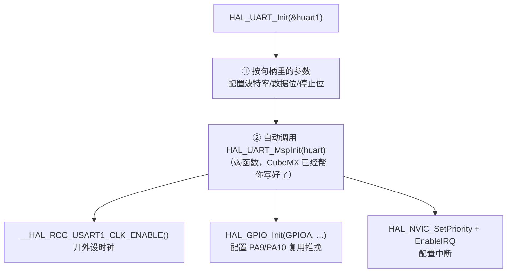
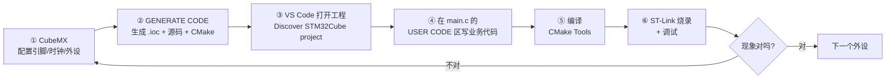

# STM32 HAL 库入门教程

> 学习方法主线：**在 CubeMX 里点配置 → 读懂生成的代码 → 改一处 → 立刻烧录看现象**。
> 不背寄存器，不抄例程，每个外设都亲手跑通一次才算学会。

!!! info "写给有标准库基础的你"
    本教程**假设你没写过 HAL**，从头讲起。
    但你用过标准库（SPL），会走得比零基础快很多——每章末尾都有一个可折叠的
    <code>标准库对照</code> 块，把 HAL 写法映射回你熟悉的 SPL 写法，不想看可以直接跳过。

    一句话先给你定心：**HAL 不是新东西，它只是把 `GPIO_SetBits()` 换成了
    `HAL_GPIO_WritePin()`，再帮你把时钟、引脚、中断的初始化流程自动化了。**

---

## 目录

1. [准备工作：硬件与软件](#1-准备工作硬件与软件)
2. [先搞懂 5 件事：HAL 到底是什么](#2-先搞懂-5-件事hal-到底是什么)
3. [完整工作流（一天 5 分钟记住它）](#3-完整工作流一天-5-分钟记住它)
4. [CubeMX 上手：创建第一个工程](#4-cubemx-上手创建第一个工程)
5. [工程结构导读：哪些文件能改，哪些不能](#5-工程结构导读哪些文件能改哪些不能)
6. [HAL 的核心心智模型](#6-hal-的核心心智模型)
7. [第一个程序：点亮 LED](#7-第一个程序点亮-led)
8. [按键输入](#8-按键输入)
9. [外部中断 EXTI](#9-外部中断-exti)
10. [串口 UART 与 printf 重定向](#10-串口-uart-与-printf-重定向)
11. [定时器](#11-定时器)
12. [PWM 输出](#12-pwm-输出)
13. [ADC 采样](#13-adc-采样)
14. [I2C 与 SPI 入门](#14-i2c-与-spi-入门)
15. [编译、烧录、调试](#15-编译烧录调试)
16. [常见坑与避坑指南](#16-常见坑与避坑指南)
17. [标准库 → HAL 速查对照表](#17-标准库--hal-速查对照表)
18. [免费学习资源](#18-免费学习资源)

---

## 1. 准备工作：硬件与软件

### 1.1 硬件清单

| 物品 | 说明 | 参考价 |
|---|---|---|
| STM32F103C8T6 最小系统板 | 俗称"蓝钩子"/Blue Pill，72MHz / 64KB Flash / 20KB RAM | 10~15 元 |
| ST-Link V2 调试器 | 负责烧录 + 调试，USB 棒状那种 | 15~25 元 |
| USB 转 TTL 模块 | CH340 / CP2102，用来看串口打印 | 5~10 元 |
| 面包板 + 杜邦线 | 接线用 | 10 元 |
| LED + 220Ω 电阻 | 板载 PC13 已有一个 LED，外接的用来练手 | 忽略不计 |

### 1.2 ST-Link 接线（**最容易接错的地方**）

蓝钩子上的 SWD 接口是 **4 针**，丝印顺序经常和 ST-Link 的排线顺序**不一致**，必须看丝印：

| ST-Link V2 | 蓝钩子丝印 | 作用 |
|---|---|---|
| `3.3V` | `3V3` | 供电（板子也可以用 USB 单独供电，但**不要两边同时供**） |
| `SWDIO` | `DIO`（或 `SWDIO`） | 数据线 |
| `SWCLK` | `CLK`（或 `SWCLK`） | 时钟线 |
| `GND` | `GND` | 共地，**必须接** |

!!! danger "接错会烧板子"
    蓝钩子上还有一个 `5V` 针脚。**不要把 5V 接到 ST-Link 的 3.3V**。
    接线前先把板子断电，接好再上电。

### 1.3 需要检查的 4 件事

- **BOOT0 跳线帽**：必须短接到 `0`（也就是接 GND 那一侧），否则芯片从系统存储器启动，你的程序根本不跑
- **板载 LED**：PC13，**低电平点亮**（`GPIO_PIN_RESET` 亮，`GPIO_PIN_SET` 灭）
- **8MHz 晶振**：蓝钩子板上有一个 8MHz 的贴片晶振，我们靠它倍频到 72MHz
- **USB 线**：ST-Link 一定要插在能传数据的口上，有些线只能充电

### 1.4 软件（Linux 环境下）

你机器上这套工具链**已经装好了**，都在 `~/.local/share/stm32cube/bundles/` 里由 VS Code 扩展自动管理：

| 组件 | 版本 | 作用 |
|---|---|---|
| STM32CubeMX | 6.18.1 | 图形化配置引脚/时钟/外设，**生成代码** |
| VS Code + STM32CubeIDE for VS Code | 3.10.0 | 写代码、编译、烧录、调试 |
| GNU Tools for STM32 | 14.3.1 | 编译器 `arm-none-eabi-gcc` + 调试器 `arm-none-eabi-gdb` |
| CMake / Ninja | 4.3.1 / 1.13.2 | 构建系统 |
| STM32CubeProgrammer CLI | 2.23.0 | 烧录 |

**启动 CubeMX 的两种方式**：

```bash
# 方式一：VS Code 里点
#   STM32 侧边栏 → Actions → 「启动 STM32CubeMX」

# 方式二：命令行直接跑
~/Applications/STM32CubeMX/STM32CubeMX
```

!!! tip "固件包会在第一次生成工程时下载"
    CubeMX 本身不含芯片的 HAL 驱动源码。第一次给某个系列（比如 F1）生成工程时，
    它会去 ST 服务器下载对应的固件包（`STM32Cube_FW_F1_Vx.x.x`，约 100~300MB），
    存到 `~/STM32Cube/Repository/`。**第一次会慢，之后就一直复用。**

---

## 2. 先搞懂 5 件事：HAL 到底是什么

学 HAL 最大的误区是"把它当成另一套标准库去背"。**它俩的分工完全不同**，先建立这 5 个心智模型：

### ① HAL = Hardware Abstraction Layer，硬件抽象层

```
你的应用代码
    ↓
  HAL 库        ← 你主要打交道的层
    ↓
  LL 库（可选）  ← 轻量级，接近寄存器
    ↓
  寄存器
```

- **标准库（SPL）**：ST 2011 年前后推出，已**停止维护**，只覆盖 F0/F1/F2/F3/F4/L0/L1
- **HAL 库**：ST 主推的现代方案，全系列覆盖，配套 CubeMX 图形化生成，**现在的新项目都应该用它**
- 两者**不能混用**，选了 HAL 就全套 HAL

### ② 一个外设 = 一个"句柄"结构体

标准库时代，外设状态是**全局的**——`USART1` 就是个固定的外设，你直接操作它。

HAL 引入了**面向对象的思路**：每个外设实例都有一个**句柄（Handle）**，所有配置和运行状态都装在里头。

```c
UART_HandleTypeDef huart1;    // 串口 1 的句柄
TIM_HandleTypeDef  htim2;     // 定时器 2 的句柄
ADC_HandleTypeDef  hadc1;     // ADC1 的句柄
```

- `h` 前缀 = handle，这是 HAL 的命名约定
- 句柄是**全局变量**，定义在 `main.c` 顶部，`extern` 声明在 `main.h` 里
- 好处：同型号的多个外设可以复用同一套代码（`HAL_UART_Init(&huart1)` / `HAL_UART_Init(&huart2)`）

### ③ 初始化分两层：`Init` 和 `MspInit`

这是 HAL 最反直觉、也最容易懵的地方。你调用一次 `HAL_UART_Init()`，它内部**自动**帮你干了两件事：



| 层 | 函数 | 放在哪 | 干什么 |
|---|---|---|---|
| **通用层** | `HAL_UART_Init()` | `main.c` 里 CubeMX 生成 | 波特率、数据位、校验等**参数** |
| **底层 MSP** | `HAL_UART_MspInit()` | `stm32f1xx_hal_msp.c` | 时钟使能、**引脚复用**、中断优先级 |

> **MSP = MCU Support Package**。凡是"和具体引脚/时钟有关"的初始化，都被 CubeMX 塞进 MSP 里。
> 所以你**不需要**自己去开时钟、配引脚——点完 CubeMX 就都有了。

### ④ 中断靠"弱函数回调"

标准库时代，中断服务函数 `USART1_IRQHandler()` 要你自己写，还要自己清标志位。

HAL 把它拆成两层：

```c
/* stm32f1xx_it.c —— CubeMX 生成，你基本不用动 */
void USART1_IRQHandler(void)
{
  HAL_UART_IRQHandler(&huart1);       // ← 转交给 HAL 统一处理
}

/* 你的代码 —— 只需要"重定义"这个弱函数 */
void HAL_UART_RxCpltCallback(UART_HandleTypeDef *huart)
{
  if (huart->Instance == USART1) {
    // 收到数据了，干活
  }
}
```

`__weak` 是 ARM 编译器的关键字：**弱符号**。HAL 库里已经有一份空的实现，你在自己的 `.c` 文件里再定义一份同名的，链接器会**优先用你的**。

!!! tip "记住这个套路就够用了"
    `HAL_xxx_IRQHandler()` 由 CubeMX 放进 `stm32f1xx_it.c`，**你不用管**；
    你只需要重写 `HAL_xxx_Callback()`，业务逻辑写在里面。

### ⑤ 所有 HAL 函数都返回状态码

```c
HAL_StatusTypeDef ret;
ret = HAL_UART_Transmit(&huart1, buf, len, 100);

if (ret != HAL_OK) { /* 处理错误 */ }
```

| 返回值 | 含义 |
|---|---|
| `HAL_OK` | 成功 |
| `HAL_ERROR` | 出错 |
| `HAL_BUSY` | 外设正忙（上一次传输还没结束） |
| `HAL_TIMEOUT` | 超时（最后一个参数就是超时毫秒数） |

**好习惯**：对可能失败的调用都检查返回值。标准库不返回状态，只能靠标志位，HAL 这点反而更省事。

---

## 3. 完整工作流（一天 5 分钟记住它）

```
CubeMX 点配置 → GENERATE CODE → VS Code 打开 → 写 USER CODE → 编译 → 烧录 → 看现象
      ↑                                                                      │
      └──────────────── 现象不对，回去改配置或改代码 ←──────────────────────────┘
```



**核心闭环就是"改一处 → 烧一次 → 看一眼"**，不要一次配一堆外设。

---

## 4. CubeMX 上手：创建第一个工程

### 4.1 新建工程

1. 打开 STM32CubeMX（VS Code 侧边栏 → Actions → **启动 STM32CubeMX**）
2. 菜单 **File → New Project**
3. 选择目标方式：
    - 按**芯片**选：在左上角搜索框输入 `STM32F103C8`
    - 按**开发板**选：`Board Selector` 标签页里搜 `Blue Pill`
4. 在列表里点中 `STM32F103C8Tx`，双击或点 **Start Project**

### 4.2 配置调试接口（**漏了这步芯片会被锁**）

进入 `Pinout & Configuration` → 左侧 `System Core` → **SYS**：

| 选项 | 设为 | 为什么 |
|---|---|---|
| Debug | **Serial Wire** | 开启 SWD 调试。**不改这个，烧录一次后 SWD 引脚被占用，下次就连不上了** |
| Timebase Source | SysTick（默认） | HAL 的心跳 |

!!! danger "第一步永远是配 SYS → Serial Wire"
    这是新手最常见的翻车点。忘记配的后果是：烧完程序 ST-Link 再也连不上，
    只能用 BOOT0 拉高 + 串口擦除来救。**养成习惯：新建工程第一件事就是这个。**

### 4.3 配置时钟（RCC）

`System Core` → **RCC**：

- **High Speed Clock (HSE)**：选 `Crystal/Ceramic Resonator`（用板上 8MHz 晶振）

然后切到 **Clock Configuration** 标签页，看图配置：

```
HSE 8MHz → /1 → PLL ×9 → SYSCLK 72MHz
                          ├── AHB /1  → HCLK  72MHz
                          ├── APB1 /2 → PCLK1 36MHz  (最大 36MHz)
                          └── APB2 /1 → PCLK2 72MHz
```

**操作技巧**：直接在 `HCLK` 框里输入 `72` 回车，CubeMX 会自动帮你解算 PLL 分频系数，红色报警消失即可。

!!! note "为什么是 72MHz"
    F103 的 SYSCLK 上限就是 72MHz。APB1 上限 36MHz、APB2 上限 72MHz，
    所以 APB1 必须二分频——这是 F103 的硬约束，CubeMX 会帮你校验。

### 4.4 配一个 LED（PC13）

在右侧芯片图上找到 **PC13**，左键点击 → 选 **GPIO_Output**。

然后在 `System Core` → **GPIO** 里点 PC13 那一行，下方会显示详细配置：

| 参数 | 设为 | 说明 |
|---|---|---|
| GPIO output level | **High** | 初始输出高电平，蓝钩子的 LED 是低电平点亮，所以初始是"灭" |
| GPIO mode | Output Push Pull | 推挽输出 |
| GPIO Pull-up/Pull-down | No pull-up and no pull-down | 输出模式不需要上下拉 |
| Maximum output speed | Low | 点灯不需要高速 |
| User Label | `LED` | **强烈建议填**，生成的代码会变成 `LED_Pin` 宏，可读性大增 |

### 4.5 工程管理器设置（**决定后面能不能在 VS Code 里用**）

切到 **Project Manager** 标签页：

**Project 子页**：

| 项目 | 设为 |
|---|---|
| Project Name | 例如 `blink` |
| Project Location | 例如 `~/Projects/stm32`（**路径不要有空格和中文**） |
| Toolchain / IDE | **CMake** |

**Code Generator 子页**：

- ✅ `Copy only the necessary library files`（只拷贝用到的 HAL 源文件，工程体积小很多）
- ✅ `Generate peripheral initialization as a pair of .c/.h files per peripheral`（每个外设单独一对文件，代码更清爽）

!!! warning "Toolchain 选 CMake，不是 STM32CubeIDE"
    选 CMake 才能直接被 VS Code 的 STM32Cube 扩展识别、构建、调试。
    如果某个 CubeMX 版本的下拉框里**没有 CMake**，就往后退一步：
    选 `STM32CubeIDE` 生成，然后在 VS Code 里用
    **转换 Eclipse STM32CubeIDE 项目** 把它转成 CMake 工程。

### 4.6 生成代码

点右上角 **GENERATE CODE**。

- 第一次会下载 F1 固件包（100~300MB，耐心等）
- 完成后会提示 `Code generation done`

### 4.7 在 VS Code 里打开

1. VS Code → **File → Open Folder…** → 选刚才生成的工程目录
2. 底部状态栏或 `CMake` 面板里，选择一个 **configure preset**（选 `Debug`）
3. 打开 STM32 侧边栏，点 **Discover STM32Cube project**（发现 STM32Cube 项目）
4. 在弹出的 **Project Setup** 里选好 board/device、toolchain（选 GCC）、project，点 **Save and close**
5. 输出日志没有报错，就说明工程已经就绪了

!!! tip "快捷键"
    ++ctrl+shift+p++ 打开命令面板，输入 `STM32Cube` 能看到所有可用命令。

---

## 5. 工程结构导读：哪些文件能改，哪些不能

生成出来的工程长这样：

```
blink/
├── blink.ioc                    ← 【核心】CubeMX 配置，千万不要手改，用 CubeMX 打开它
├── CMakeLists.txt               ← 用户所有：高层工程定义，可以改
├── CMakePresets.json            ← 用户所有：CMake 预设（Debug/Release），可以改
├── cmake/
│   ├── gcc-arm-none-eabi.cmake  ← 用户所有：工具链设置，可以改
│   └── stm32cubemx/
│       └── CMakeLists.txt       ← 【CubeMX 所有】每次生成都会覆盖，绝对不要改
├── Core/
│   ├── Inc/
│   │   ├── main.h
│   │   ├── stm32f1xx_hal_conf.h ← HAL 模块裁剪开关（要不要编某个外设的驱动）
│   │   └── stm32f1xx_it.h
│   └── Src/
│       ├── main.c               ← 你的主战场
│       ├── stm32f1xx_it.c       ← 中断服务函数（CubeMX 生成，一般不动）
│       ├── stm32f1xx_hal_msp.c  ← 底层初始化（时钟/引脚/中断）
│       └── system_stm32f1xx.c
├── Drivers/
│   ├── CMSIS/                   ← 内核相关（启动文件、内核头文件）
│   └── STM32F1xx_HAL_Driver/    ← HAL 库源码本体
├── startup_stm32f103xb.s        ← 启动文件（汇编），负责跳到 main
└── STM32F103C8Tx_FLASH.ld       ← 链接脚本（Flash/RAM 地址分配）
```

### 文件归属三条铁律

| 归属 | 文件 | 规则 |
|---|---|---|
| **CubeMX 所有** | `cmake/stm32cubemx/CMakeLists.txt`、`Core/Src/*` 的生成部分、`Drivers/` | **不要改**，下次生成会被覆盖 |
| **用户所有** | `CMakeLists.txt`、`CMakePresets.json`、`cmake/gcc-arm-none-eabi.cmake` | 可以随便改，CubeMX 不覆盖 |
| **共享** | `main.c`、`stm32f1xx_it.c` 等 | 只能改 `USER CODE BEGIN` / `USER CODE END` 之间的部分 |

### `USER CODE` 标记：唯一安全的写代码位置

打开 `Core/Src/main.c`，你会看到一堆这样的标记：

```c
/* USER CODE BEGIN Includes */
/* 你的 #include 写这里 */

/* USER CODE END Includes */

int main(void)
{
  /* USER CODE BEGIN 1 */
  /* 变量声明写这里 */
  /* USER CODE END 1 */

  HAL_Init();
  SystemClock_Config();
  MX_GPIO_Init();

  /* USER CODE BEGIN 2 */
  /* 外设启动、初始化后的准备工作写这里 */
  /* USER CODE END 2 */

  while (1)
  {
    /* USER CODE BEGIN 3 */
    /* 主循环业务代码写这里 */
    /* USER CODE END 3 */
  }
}
```

!!! danger "写在 USER CODE 之外的代码会被删除"
    CubeMX 重新生成代码时，**只保留 `USER CODE BEGIN` 和 `USER CODE END` 之间的内容**。
    你写在别处的代码会**直接消失**，没有任何提示。

    如果代码比较多，更好的做法是**另建自己的文件**（比如 `app_led.c` / `app_led.h`），
    然后在 `CMakeLists.txt` 里把它加进源文件列表——这样完全不受 CubeMX 影响。

---

## 6. HAL 的核心心智模型

把 `main.c` 从上到下读一遍，就理解了 HAL 程序的骨架：

```c
int main(void)
{
  HAL_Init();              /* ① 初始化 HAL 库本体 + 配 SysTick 为 1ms 心跳 */
  SystemClock_Config();    /* ② 配置系统时钟到 72MHz */
  MX_GPIO_Init();          /* ③ 初始化 GPIO（你点出来的每个外设都有这么一个函数）*/
  MX_USART1_UART_Init();   /*    串口、定时器、ADC 同理 */

  while (1)                /* ④ 主循环，永不退出 */
  {
    /* 你的业务代码 */
  }
}
```

### 4 个关键机制

| 机制 | 说明 | 你要做什么 |
|---|---|---|
| `HAL_Init()` | 配 SysTick 1ms 中断 → `HAL_Delay()` 和所有超时机制都靠它 | 不用动 |
| `SystemClock_Config()` | 由 Clock Configuration 页面生成 | 不用动 |
| `MX_xxx_Init()` | 每个外设一个，内部会填入句柄参数并调用 `HAL_xxx_Init()` | 不用动 |
| `HAL_xxx_MspInit()` | 弱函数，在 `stm32f1xx_hal_msp.c` 里，CubeMX 已生成 | 不用动 |

> **所以：CubeMX 点完，初始化就全好了。你的工作从 `while(1)` 开始。**

### 常用 HAL 前缀速记

| 前缀 | 含义 | 例子 |
|---|---|---|
| `HAL_` | HAL 库函数本体 | `HAL_GPIO_WritePin()` |
| `__HAL_` | 宏形式的底层操作（本质是寄存器操作封装） | `__HAL_RCC_GPIOA_CLK_ENABLE()` |
| `HAL_xxx_MspInit` | 底层初始化（弱函数） | `HAL_UART_MspInit()` |
| `HAL_xxx_Callback` | 中断回调（弱函数，**你重写这个**） | `HAL_GPIO_EXTI_Callback()` |
| `HAL_xxx_IRQHandler` | 中断入口（CubeMX 生成，转交给 HAL） | `USART1_IRQHandler()` |

---

## 7. 第一个程序：点亮 LED

CubeMX 里 PC13 已经配成 `Output`（User Label = `LED`），代码已经生成好了。打开 `Core/Src/main.c`：

```c
while (1)
{
  /* USER CODE BEGIN 3 */
  HAL_GPIO_WritePin(LED_GPIO_Port, LED_Pin, GPIO_PIN_RESET);  /* 拉低 → 点亮 */
  HAL_Delay(500);
  HAL_GPIO_WritePin(LED_GPIO_Port, LED_Pin, GPIO_PIN_SET);    /* 拉高 → 熄灭 */
  HAL_Delay(500);
  /* USER CODE END 3 */
}
```

编译烧录，LED 应该 0.5 秒一闪。

### 三个最常用的 GPIO 函数

| 函数 | 作用 |
|---|---|
| `HAL_GPIO_WritePin(端口, 引脚, 状态)` | 写电平，状态是 `GPIO_PIN_SET`(高) / `GPIO_PIN_RESET`(低) |
| `HAL_GPIO_TogglePin(端口, 引脚)` | 翻转电平，**闪灯最常用** |
| `HAL_GPIO_ReadPin(端口, 引脚)` | 读电平，返回 `GPIO_PinState` |

用 `TogglePin` 可以把代码简化成：

```c
while (1)
{
  HAL_GPIO_TogglePin(LED_GPIO_Port, LED_Pin);
  HAL_Delay(500);
}
```

!!! note "`LED_GPIO_Port` 和 `LED_Pin` 是什么"
    因为你在 CubeMX 里把 User Label 填成了 `LED`，CubeMX 在 `main.h` 里生成了：

    ```c
    #define LED_Pin GPIO_PIN_13
    #define LED_GPIO_Port GPIOC
    ```

    **这就是填 User Label 的价值**——不然代码里全是 `GPIO_PIN_13` / `GPIOC`，
    过一个月你自己都忘了 PC13 接的是什么。

!!! tip "HAL_Delay 的注意点"
    - 单位是**毫秒**，靠 SysTick 中断实现
    - 它是**阻塞**的：调用期间 CPU 空转，什么也干不了
    - **不要在中断服务函数里调用它**！中断优先级比 SysTick 高的时候会直接卡死

??? quote "标准库对照"
    ```c
    /* 标准库 SPL */
    RCC_APB2PeriphClockCmd(RCC_APB2Periph_GPIOC, ENABLE);   // 手动开时钟

    GPIO_InitTypeDef gpio;
    gpio.GPIO_Pin   = GPIO_Pin_13;
    gpio.GPIO_Mode  = GPIO_Mode_Out_PP;
    gpio.GPIO_Speed = GPIO_Speed_50MHz;
    GPIO_Init(GPIOC, &gpio);                                 // 手动配引脚

    GPIO_SetBits(GPIOC, GPIO_Pin_13);                        // 置高
    GPIO_ResetBits(GPIOC, GPIO_Pin_13);                      // 置低
    GPIO_WriteBit(GPIOC, GPIO_Pin_13, (BitAction)(1 - GPIO_ReadOutputDataBit(GPIOC, GPIO_Pin_13)));  // 翻转，很啰嗦
    ```

    **HAL 的对应用法**：开时钟和配引脚由 MSP 自动完成，你只写最后两行：

    ```c
    HAL_GPIO_WritePin(GPIOC, GPIO_PIN_13, GPIO_PIN_SET);
    HAL_GPIO_WritePin(GPIOC, GPIO_PIN_13, GPIO_PIN_RESET);
    HAL_GPIO_TogglePin(GPIOC, GPIO_PIN_13);   // 翻转直接有现成函数
    ```

    差异点：
    1. **不用手动开时钟**（MSP 里有了）
    2. **不用手动填 GPIO_InitTypeDef**（CubeMX 生成在 `MX_GPIO_Init()` 里了）
    3. **命名从 `GPIO_Pin_13` 变成 `GPIO_PIN_13`**（大写 PIN，这是从 SPL 迁移过来最容易拼错的地方）
    4. 多了 `TogglePin`

---

## 8. 按键输入

### 8.1 硬件

按键一端接 **PA0**，另一端接 **GND**（这样按下时 PA0 接地 = 低电平）。

### 8.2 CubeMX 配置

1. 点 **PA0** → 选 **GPIO_Input**
2. `System Core` → **GPIO** → 选中 PA0 → 配置：

| 参数 | 设为 | 为什么 |
|---|---|---|
| GPIO mode | Input mode | 输入 |
| GPIO Pull-up/Pull-down | **Pull-up** | 内部上拉。不按 = 高电平，按下 = 低电平，**不需要外接电阻** |
| User Label | `KEY` | 方便引用 |

### 8.3 代码：轮询方式

```c
while (1)
{
  /* USER CODE BEGIN 3 */
  if (HAL_GPIO_ReadPin(KEY_GPIO_Port, KEY_Pin) == GPIO_PIN_RESET)  /* 按下 = 低 */
  {
    HAL_Delay(20);   /* 软件消抖，等 20ms */
    if (HAL_GPIO_ReadPin(KEY_GPIO_Port, KEY_Pin) == GPIO_PIN_RESET)
    {
      HAL_GPIO_TogglePin(LED_GPIO_Port, LED_Pin);

      /* 等松手，防止按一次触发多次 */
      while (HAL_GPIO_ReadPin(KEY_GPIO_Port, KEY_Pin) == GPIO_PIN_RESET);
    }
  }
  /* USER CODE END 3 */
}
```

### 8.4 消抖：为什么必须要

机械按键按下/松开的瞬间，触点会**弹跳**几毫秒，电平在高低之间抖好几次。不消抖的话按一下会触发好几次。

| 消抖方式 | 做法 | 优缺点 |
|---|---|---|
| **软件延时**（上面这种） | `HAL_Delay(20)` 后再读一次 | 简单，但阻塞 20ms |
| **定时器扫描** | 定时器 10ms 中断里读一次，连续 N 次相同才算按下 | 不阻塞，推荐进阶用 |
| **硬件 RC 滤波** | 并一个 0.1µF 电容 | 好，但要加元件 |
| **外部中断 + 定时器** | 中断触发后启动定时器，50ms 后再确认 | 第 9 章会讲 |

??? quote "标准库对照"
    ```c
    /* 标准库 */
    RCC_APB2PeriphClockCmd(RCC_APB2Periph_GPIOA, ENABLE);
    GPIO_InitTypeDef gpio;
    gpio.GPIO_Pin  = GPIO_Pin_0;
    gpio.GPIO_Mode = GPIO_Mode_IPU;      // 上拉输入
    GPIO_Init(GPIOA, &gpio);

    if (GPIO_ReadInputDataBit(GPIOA, GPIO_Pin_0) == Bit_RESET) { /* 按下 */ }

    /* HAL */
    if (HAL_GPIO_ReadPin(GPIOA, GPIO_PIN_0) == GPIO_PIN_RESET) { /* 按下 */ }
    ```

    标准库返回 `Bit_RESET` / `Bit_SET`，HAL 返回 `GPIO_PIN_RESET` / `GPIO_PIN_SET`。
    **都是 RESET 代表低电平**，这点是一致的，不容易搞混。

---

## 9. 外部中断 EXTI

轮询方式要一直占着 CPU 转圈。**中断方式**是：平时 CPU 干别的，按键一按，硬件自动打断去执行处理函数。

### 9.1 CubeMX 配置

1. 点 **PA0** → 选 **GPIO_EXTI0**（注意不是 GPIO_Input）
2. `System Core` → **GPIO** → 选中 PA0，配置：

| 参数 | 设为 |
|---|---|
| GPIO mode | External Interrupt Mode with **Falling edge** trigger（下降沿触发，按下时从高变低） |
| GPIO Pull-up/Pull-down | Pull-up |
| User Label | `KEY` |

3. 到 **NVIC** 页面，勾上 **EXTI line0 interrupt** 的 `Enabled`：

| 参数 | 建议值 | 说明 |
|---|---|---|
| Preemption Priority | 1 | 抢占优先级，数字越小越优先 |
| Sub Priority | 0 | 子优先级 |

!!! warning "中断优先级别乱设"
    - `HAL_Delay()` 靠 SysTick，SysTick 默认优先级是 **0（最高）**
    - **如果给 EXTI 设了比 0 还"高"的优先级（负数）**，中断里调用 `HAL_Delay()` 会永久卡死
    - 一般外设给 1~3 就够了，**留 0 给系统**

### 9.2 重写回调函数

CubeMX 生成了 `EXTI0_IRQHandler()` 在 `stm32f1xx_it.c` 里，它会调用 `HAL_GPIO_EXTI_IRQHandler()`，后者最终调用我们的回调。

**你只需要写回调**。位置建议放在 `main.c` 的 `USER CODE BEGIN 4` 区：

```c
/* USER CODE BEGIN 4 */
void HAL_GPIO_EXTI_Callback(uint16_t GPIO_Pin)
{
  if (GPIO_Pin == KEY_Pin)          /* 判断是哪个引脚触发 */
  {
    HAL_GPIO_TogglePin(LED_GPIO_Port, LED_Pin);
  }
}
/* USER CODE END 4 */
```

主循环保持空的（或者干别的事），不再需要轮询：

```c
while (1)
{
  /* USER CODE BEGIN 3 */
  /* 主循环空闲，按键由中断处理 */
  /* USER CODE END 3 */
}
```

### 9.3 中断回调的执行规则

!!! danger "中断服务函数里必须遵守的三条"
    1. **绝对不要用 `HAL_Delay()`** —— 它是阻塞的，会卡死整个中断系统
    2. **执行时间要尽可能短** —— 中断里只做"标记"，复杂处理丢给主循环
    3. **不要用 `printf`** —— 串口发送会阻塞很久（除非用中断/DMA 方式）

**正确姿势**：中断里只设一个标志，主循环检测标志再处理：

```c
volatile uint8_t key_flag = 0;      /* volatile！中断和主循环都会访问 */

void HAL_GPIO_EXTI_Callback(uint16_t GPIO_Pin)
{
  if (GPIO_Pin == KEY_Pin) key_flag = 1;
}

while (1)
{
  if (key_flag)
  {
    key_flag = 0;
    HAL_Delay(20);                        /* 消抖，现在在主循环里，安全 */
    if (HAL_GPIO_ReadPin(KEY_GPIO_Port, KEY_Pin) == GPIO_PIN_RESET)
      HAL_GPIO_TogglePin(LED_GPIO_Port, LED_Pin);
  }
}
```

??? quote "标准库对照"
    ```c
    /* 标准库：中断服务函数要自己完整写，还要自己清标志位 */
    void EXTI0_IRQHandler(void)
    {
      if (EXTI_GetITStatus(EXTI_Line0) != RESET)
      {
        // 业务逻辑
        EXTI_ClearITPendingBit(EXTI_Line0);   // 必须手动清标志，忘了会反复进中断
      }
    }

    /* HAL：中断入口由 CubeMX 生成并转交，你只写回调，标志位 HAL 帮你清 */
    void HAL_GPIO_EXTI_Callback(uint16_t GPIO_Pin)
    {
      // 业务逻辑
    }
    ```

    **这是 HAL 相比 SPL 最省事的地方之一**：清中断标志、判断中断源这些琐事
    HAL 都封装好了，你只面对"发生了什么事"。

---

## 10. 串口 UART 与 printf 重定向

串口是嵌入式调试的**第一神器**——看不到现象的时候，先让它把信息打出来。

### 10.1 接线

| 蓝钩子 | USB-TTL 模块 |
|---|---|
| `PA9` (USART1_TX) | `RXD` |
| `PA10` (USART1_RX) | `TXD` |
| `GND` | `GND` |

!!! warning "TX 接 RX，交叉接线"
    自己的 TX 要接到对方的 RX。接成 TX-TX 是完全没反应的，新手经常在这里卡半天。

### 10.2 CubeMX 配置

1. `Connectivity` → **USART1** → Mode 选 **Asynchronous**
2. 下方 `Parameter Settings`：

| 参数 | 值 |
|---|---|
| Baud Rate | 115200 |
| Word Length | 8 Bits |
| Parity | None |
| Stop Bits | 1 |
| Data Direction | Receive and Transmit |

3. `NVIC Settings` 标签页：勾上 **USART1 global interrupt**（要用中断接收的话必须开）

Pinout 图上 PA9/PA10 会自动变成绿色（已复用）。

### 10.3 printf 重定向（**必须做的一步**）

HAL 库的 `printf` 默认不知道往哪输出，要重写底层 `fputc`：

```c
/* USER CODE BEGIN Includes */
#include <stdio.h>
/* USER CODE END Includes */

/* USER CODE BEGIN 4 */
/* 重定向 printf 到串口 1 —— GCC 用的是 _write，不是 fputc */
int _write(int file, char *ptr, int len)
{
  HAL_UART_Transmit(&huart1, (uint8_t *)ptr, len, HAL_MAX_DELAY);
  return len;
}
/* USER CODE END 4 */
```

!!! warning "Keil 和 GCC 的重定向函数不一样"
    | 工具链 | 要重写的函数 |
    |---|---|
    | Keil MDK (ARMCC) | `int fputc(int ch, FILE *f)` |
    | **GCC (arm-none-eabi)** | `int _write(int file, char *ptr, int len)` |
    | IAR | `int __write(int handle, const unsigned char *buf, int size)` |

    你用的是 GCC 工具链，**所以要用 `_write`**。
    网上大量教程是 Keil 版的 `fputc`，直接抄过来在 GCC 下编译能过但**打印不出东西**。

### 10.4 打印测试

```c
/* USER CODE BEGIN 2 */
printf("STM32F103 HAL 启动成功!\r\n");
printf("SYSCLK = %lu Hz\r\n", HAL_RCC_GetSysClockFreq());
/* USER CODE END 2 */

uint32_t cnt = 0;
while (1)
{
  /* USER CODE BEGIN 3 */
  printf("计数: %lu\r\n", cnt++);
  HAL_Delay(1000);
  /* USER CODE END 3 */
}
```

用串口助手（VS Code 里的 **Serial Monitor** 扩展，或者 `picocom` / `minicom`）打开 `/dev/ttyUSB0`，波特率 115200。

```bash
# 命令行看串口
sudo apt install picocom
picocom -b 115200 /dev/ttyUSB0
# 退出：Ctrl+A 然后 Ctrl+X
```

!!! tip "`\r\n` 不能只写 `\n`"
    串口助手大多按"回车换行"判断一行结束。只发 `\n` 有的终端会一直在一行里堆。
    **养成习惯写 `\r\n`**。

### 10.5 中断方式接收（`HAL_UART_Receive_IT`）

轮询接收 `HAL_UART_Receive()` 会阻塞，等不到数据就干不了别的。中断接收才是实用方式：

```c
/* USER CODE BEGIN PV */
uint8_t rx_byte;                       /* 单字节接收缓冲 */
/* USER CODE END PV */

/* USER CODE BEGIN 2 */
HAL_UART_Receive_IT(&huart1, &rx_byte, 1);   /* 启动第一次接收 */
/* USER CODE END 2 */

/* USER CODE BEGIN 4 */
void HAL_UART_RxCpltCallback(UART_HandleTypeDef *huart)
{
  if (huart->Instance == USART1)
  {
    /* 收到一个字节 → 原样回显 */
    HAL_UART_Transmit(&huart1, &rx_byte, 1, 100);

    /* 【关键】接收完成回调里必须重新启动接收，否则只会收到一次 */
    HAL_UART_Receive_IT(&huart1, &rx_byte, 1);
  }
}
/* USER CODE END 4 */
```

!!! danger "回调里必须重新 `HAL_UART_Receive_IT`"
    这是 HAL 串口中断**最经典的坑**：`_IT` 后缀的函数是**一次性**的，
    收完指定长度就自动关闭中断。不重新调用，你只会收到第一字节，后面全部丢失。

### 10.6 DMA 接收（进阶）

中断方式每个字节进一次中断，115200 波特率下勉强够用；更高波特率或大数据量就要用 DMA：

```c
/* 空闲中断 + DMA，接收不定长数据 */
HAL_UART_Receive_DMA(&huart1, rx_buf, sizeof(rx_buf));
__HAL_UART_ENABLE_IT(&huart1, UART_IT_IDLE);   /* 开空闲中断 */
```

原理：DMA 负责搬数据不占 CPU，"空闲中断"在一帧数据结束后触发，此时读 DMA 剩余计数就知道收了多少字节。**这是工业界最常用的串口接收方案**，初学可以先跳过，知道有这么回事即可。

??? quote "标准库对照"
    ```c
    /* 标准库：发送要自己等标志位 */
    void uart_send_byte(uint8_t c)
    {
      while (USART_GetFlagStatus(USART1, USART_FLAG_TXE) == RESET);
      USART_SendData(USART1, c);
    }

    /* HAL：一行搞定，还会返回状态 */
    HAL_UART_Transmit(&huart1, &c, 1, 100);
    ```

    | 操作 | 标准库 | HAL |
    |---|---|---|
    | 发一字节 | `USART_SendData()` + 等 TXE | `HAL_UART_Transmit(&huart1, &c, 1, timeout)` |
    | 发一串 | 循环调用 | `HAL_UART_Transmit(&huart1, buf, len, timeout)` |
    | 接收 | `USART_ReceiveData()` + 等 RXNE | `HAL_UART_Receive(&huart1, buf, len, timeout)` |
    | 中断接收 | 手写 `USART1_IRQHandler` | `HAL_UART_Receive_IT()` + 回调 |
    | 空闲判断 | 查 `USART_FLAG_IDLE` | `__HAL_UART_GET_FLAG(&huart1, UART_FLAG_IDLE)` |

---

## 11. 定时器

### 11.1 定时器能干什么

| 用途 | 说明 |
|---|---|
| **精确定时中断** | 替代 `HAL_Delay()`，不阻塞 CPU |
| **PWM 输出** | 调 LED 亮度、控电机速度（第 12 章） |
| **输入捕获** | 测频率、测脉宽（红外遥控解码） |
| **编码器接口** | 读电机编码器 |

### 11.2 CubeMX 配置 TIM2（1 秒定时）

1. `Timers` → **TIM2**
2. `Clock Source` 选 **Internal Clock**
3. `Configuration` → `Parameter Settings`：

| 参数 | 值 | 计算方式 |
|---|---|---|
| Prescaler (PSC) | **7199** | 72MHz / (7199+1) = 10kHz |
| Counter Period (ARR) | **9999** | 10kHz / (9999+1) = **1Hz** → 1 秒 |
| auto-reload preload | Enable | |

**定时时间公式**（背下来）：

$$
T = \frac{(\text{PSC}+1)\times(\text{ARR}+1)}{f_{\text{TIMx}}}
$$

其中 $f_{\text{TIMx}}$ 是定时器时钟。TIM2 挂在 **APB1**（36MHz），但 APB1 分频系数 != 1 时，定时器时钟**自动 ×2** → 所以 TIM2 的实际时钟是 **72MHz**。

!!! note "APB1 上的定时器为什么是 72MHz"
    F103 的规则：APB 预分频系数 = 1 时，定时器时钟 = APB 时钟；
    **APB 预分频系数 ≠ 1 时，定时器时钟 = APB 时钟 × 2**。

    APB1 = 36MHz（分频系数 2 ≠ 1），所以 TIM2 时钟 = 36 × 2 = **72MHz**。
    这个"×2"规则坑了无数人，计时不对先查这里。

4. `NVIC Settings` → 勾上 **TIM2 global interrupt**

### 11.3 代码

```c
/* USER CODE BEGIN 2 */
HAL_TIM_Base_Start_IT(&htim2);      /* 启动定时器 + 开中断 */
/* USER CODE END 2 */

/* USER CODE BEGIN 4 */
void HAL_TIM_PeriodElapsedCallback(TIM_HandleTypeDef *htim)
{
  if (htim->Instance == TIM2)
  {
    HAL_GPIO_TogglePin(LED_GPIO_Port, LED_Pin);   /* 每秒翻转一次 */
  }
}
/* USER CODE END 4 */
```

主循环空着，LED 就会自己 1 秒闪一次——**完全不占 CPU**。

### 11.4 用定时器做按键扫描（不阻塞的消抖）

```c
/* 10ms 定时器中断里扫描按键 */
void HAL_TIM_PeriodElapsedCallback(TIM_HandleTypeDef *htim)
{
  static uint8_t cnt = 0;
  if (htim->Instance == TIM3)
  {
    if (HAL_GPIO_ReadPin(KEY_GPIO_Port, KEY_Pin) == GPIO_PIN_RESET)
    {
      if (++cnt >= 3)                  /* 连续 3 次都是按下 = 30ms，确认有效 */
      {
        cnt = 0;
        key_flag = 1;                  /* 通知主循环 */
      }
    }
    else cnt = 0;
  }
}
```

这样按键"按一下只触发一次"，且主循环完全不阻塞。**这是实际项目里的标准做法**。

??? quote "标准库对照"
    ```c
    /* 标准库 */
    RCC_APB1PeriphClockCmd(RCC_APB1Periph_TIM2, ENABLE);
    TIM_TimeBaseInitTypeDef tim;
    tim.TIM_Prescaler     = 7199;
    tim.TIM_Period        = 9999;
    tim.TIM_CounterMode   = TIM_CounterMode_Up;
    tim.TIM_ClockDivision = TIM_CKD_DIV1;
    TIM_TimeBaseInit(TIM2, &tim);

    TIM_ITConfig(TIM2, TIM_IT_Update, ENABLE);
    TIM_Cmd(TIM2, ENABLE);

    void TIM2_IRQHandler(void)
    {
      if (TIM_GetITStatus(TIM2, TIM_IT_Update) != RESET)
      {
        // 业务
        TIM_ClearITPendingBit(TIM2, TIM_IT_Update);   // 手动清
      }
    }

    /* HAL */
    HAL_TIM_Base_Start_IT(&htim2);                    // 一行搞定启动+开中断
    void HAL_TIM_PeriodElapsedCallback(TIM_HandleTypeDef *htim)  // 只写回调
    {
      // 业务
    }
    ```

    | 操作 | 标准库 | HAL |
    |---|---|---|
    | 启动定时器 | `TIM_Cmd(TIM2, ENABLE)` | `HAL_TIM_Base_Start(&htim2)` |
    | 启动 + 开中断 | `TIM_Cmd` + `TIM_ITConfig` | `HAL_TIM_Base_Start_IT(&htim2)` |
    | 中断逻辑 | 手写 `TIMx_IRQHandler` + 清标志 | `HAL_TIM_PeriodElapsedCallback()` |
    | 改周期 | `TIM_SetAutoreload(TIM2, v)` | `__HAL_TIM_SET_AUTORELOAD(&htim2, v)` |

---

## 12. PWM 输出

PWM 的本质是**快速开关**，通过改变"高电平占的比例"（占空比）来等效出不同电压。

### 12.1 呼吸灯原理

LED 亮 50% 时间 → 看起来就是半亮。占空比从 0% 慢慢加到 100%，再从 100% 降到 0%，就是呼吸灯。

### 12.2 CubeMX 配置 TIM3_CH1（PB4）

1. `Timers` → **TIM3**
2. `Clock Source` 选 **Internal Clock**
3. `Channel1` 选 **PWM Generation CH1**
4. `Parameter Settings`：

| 参数 | 值 | 说明 |
|---|---|---|
| Prescaler | 71 | 72MHz/(71+1) = 1MHz |
| Counter Period (ARR) | 999 | 1MHz/1000 = **1kHz** PWM 频率 |
| Pulse (CCR1) | 500 | 初始占空比 50% |

**占空比公式**：

$$
\text{占空比} = \frac{\text{CCR}}{\text{ARR}+1} = \frac{500}{1000} = 50\%
$$

!!! note "PWM 频率怎么选"
    - **LED 调光**：1kHz~10kHz（太低会看到闪烁，人眼约 60Hz 以上就看不出了）
    - **舵机**：50Hz（周期 20ms），脉宽 0.5~2.5ms 对应 0~180°
    - **电机**：10kHz~20kHz（太低会有啸叫）

### 12.3 代码

```c
/* USER CODE BEGIN 2 */
HAL_TIM_PWM_Start(&htim3, TIM_CHANNEL_1);     /* 启动 PWM 输出 */
/* USER CODE END 2 */

uint16_t duty = 0;
int8_t   dir  = 1;
while (1)
{
  /* USER CODE BEGIN 3 */
  __HAL_TIM_SET_COMPARE(&htim3, TIM_CHANNEL_1, duty);   /* 改占空比 */

  duty += dir * 10;
  if (duty >= 1000) { duty = 1000; dir = -1; }
  if (duty == 0)    { dir = 1; }
  HAL_Delay(10);
  /* USER CODE END 3 */
}
```

### 12.4 三个关键宏

| 宏 | 作用 |
|---|---|
| `__HAL_TIM_SET_COMPARE(&htim, 通道, 值)` | 设置比较值（= 改占空比） |
| `__HAL_TIM_SET_AUTORELOAD(&htim, 值)` | 设置周期（= 改频率） |
| `__HAL_TIM_GET_COUNTER(&htim)` | 读当前计数值 |

??? quote "标准库对照"
    ```c
    /* 标准库 */
    TIM_OCInitTypeDef oc;
    oc.TIM_OCMode      = TIM_OCMode_PWM1;
    oc.TIM_OutputState = TIM_OutputState_Enable;
    oc.TIM_Pulse       = 500;
    oc.TIM_OCPolarity  = TIM_OCPolarity_High;
    TIM_OC1Init(TIM3, &oc);
    TIM_OC1PreloadConfig(TIM3, TIM_OCPreload_Enable);
    TIM_Cmd(TIM3, ENABLE);

    TIM_SetCompare1(TIM3, 300);      // 改占空比

    /* HAL */
    HAL_TIM_PWM_Start(&htim3, TIM_CHANNEL_1);
    __HAL_TIM_SET_COMPARE(&htim3, TIM_CHANNEL_1, 300);
    ```

    注意 HAL 的 `HAL_TIM_PWM_Start()` 必须指定**通道号**，
    一个定时器有 4 个通道时要分别启动。

---

## 13. ADC 采样

### 13.1 CubeMX 配置 ADC1_IN0（PA0）

1. 点 **PA0** → 选 **ADC1_IN0**
2. `Analog` → **ADC1** → 勾上 `IN0`
3. `Parameter Settings`：

| 参数 | 值 | 说明 |
|---|---|---|
| Mode | Independent mode | 独立模式 |
| Clock Prescaler | PCLK2 divided by 6 | ADC 时钟 = 72/6 = 12MHz（F103 上限 14MHz） |
| Resolution | 12 bits | 0~4095 |
| Scan Conversion Mode | Disabled | 单通道不用扫描 |
| Continuous Conversion Mode | Disabled | 单次转换，要的时候再启动 |
| Data Alignment | Right alignment | 右对齐 |

4. `NVIC Settings`：勾上 **ADC1 and ADC2 global interrupt**

### 13.2 电压换算公式

$$
V_{\text{in}} = \frac{\text{ADC 原始值} \times 3.3\text{V}}{4095}
$$

12 位 ADC，参考电压 3.3V（蓝钩子的 VDDA），所以 1 个 LSB ≈ 0.806mV。

### 13.3 代码：轮询方式

```c
/* USER CODE BEGIN PV */
uint16_t adc_val = 0;
float    voltage = 0;
/* USER CODE END PV */

while (1)
{
  /* USER CODE BEGIN 3 */
  HAL_ADC_Start(&hadc1);                                    /* 启动转换 */
  HAL_ADC_PollForConversion(&hadc1, 10);                    /* 等转换完成，超时 10ms */
  adc_val = HAL_ADC_GetValue(&hadc1);                       /* 取结果 */
  HAL_ADC_Stop(&hadc1);                                     /* 停止 */

  voltage = adc_val * 3.3f / 4095.0f;                       /* 换算成电压 */
  printf("ADC=%u  电压=%.3fV\r\n", adc_val, voltage);

  HAL_Delay(500);
  /* USER CODE END 3 */
}
```

!!! warning "浮点 printf 在单片机上很占空间"
    `printf("%f")` 会拖进几十 KB 的浮点格式化代码。空间紧张时改用整数打印：

    ```c
    printf("电压=%u mV\r\n", (uint32_t)(voltage * 1000));   /* 用 mV 整数输出 */
    ```

### 13.4 多通道 + DMA（进阶）

要采集多个通道（比如 PA0~PA3 四个电位器），必须开 **Scan Mode + DMA**：

```c
uint16_t adc_buf[4];                                  /* 4 个通道的结果 */

HAL_ADC_Start_DMA(&hadc1, (uint32_t *)adc_buf, 4);    /* 一次启动，DMA 自动搬运 */
```

CubeMX 里要额外配置：`Scan Conversion Mode = Enabled`、`Number of Conversion = 4`、`DMA Settings` 里添加 ADC1 的 DMA 请求（Mode 选 Circular）。

??? quote "标准库对照"
    ```c
    /* 标准库 */
    ADC_RegularChannelConfig(ADC1, ADC_Channel_0, 1, ADC_SampleTime_55Cycles5);
    ADC_Cmd(ADC1, ENABLE);
    ADC_ResetCalibration(ADC1);  while (ADC_GetResetCalibrationStatus(ADC1));
    ADC_StartCalibration(ADC1);  while (ADC_GetCalibrationStatus(ADC1));   // 校准必须自己做

    ADC_SoftwareStartConvCmd(ADC1, ENABLE);
    while (ADC_GetFlagStatus(ADC1, ADC_FLAG_EOC) == RESET);
    uint16_t v = ADC_GetConversionValue(ADC1);

    /* HAL */
    HAL_ADC_Start(&hadc1);
    HAL_ADC_PollForConversion(&hadc1, 10);
    uint16_t v = HAL_ADC_GetValue(&hadc1);
    ```

    **HAL 帮你做了 ADC 校准**——`HAL_ADC_Init()` 内部会自动执行校准流程，
    这是 SPL 时代必须手写、忘了就导致采样不准的经典坑。

---

## 14. I2C 与 SPI 入门

这一节只讲**怎么把 CubeMX 配通**，具体器件协议看器件手册。

### 14.1 I2C（以 OLED / MPU6050 为例）

**CubeMX 配置**：

1. `Connectivity` → **I2C1** → `I2C` 模式
2. `Parameter Settings`：

| 参数 | 值 |
|---|---|
| I2C Speed Mode | Fast Mode |
| I2C Clock Speed | 400000（400kHz） |
| Clock No Stretch Mode | Disabled |

Pinout 图会自动分配 **PB6 (SCL) / PB7 (SDA)**。

**硬件注意**：I2C 是**开漏**总线，**必须接上拉电阻**（一般 4.7kΩ 到 3.3V）。很多模块板载已经带了，没带就要自己加，否则通信必失败。

**代码：写寄存器**

```c
#define DEV_ADDR (0x68 << 1)      /* HAL 用的是 8 位地址，要左移一位！ */

uint8_t buf[2] = { reg, value };
HAL_I2C_Master_Transmit(&hi2c1, DEV_ADDR, buf, 2, 100);
```

**代码：读寄存器**

```c
uint8_t val;
HAL_I2C_Mem_Read(&hi2c1, DEV_ADDR, reg, I2C_MEMADD_SIZE_8BIT, &val, 1, 100);
```

!!! danger "I2C 地址要左移一位"
    器件手册给的地址（比如 MPU6050 是 `0x68`）是 **7 位地址**。
    HAL 的 API 需要**8 位格式**，所以要 `<< 1` 变成 `0xD0`。

    这是 HAL I2C 最常见的翻车点——**通信超时先检查这个**。

### 14.2 SPI（以 W25Q64 Flash 为例）

**CubeMX 配置**：`Connectivity` → **SPI1** → `Full-Duplex Master`

| 参数 | 值 |
|---|---|
| Data Size | 8 Bits |
| Clock Polarity (CPOL) | Low |
| Clock Phase (CPHA) | 1 Edge |
| Prescaler | 根据器件手册选（决定 SCK 频率） |
| NSS | Software（软件控制片选，更灵活） |

**代码**：

```c
/* 片选拉低 → 通信 → 片选拉高 */
HAL_GPIO_WritePin(CS_GPIO_Port, CS_Pin, GPIO_PIN_RESET);
HAL_SPI_Transmit(&hspi1, tx_buf, len, 100);
HAL_SPI_Receive(&hspi1, rx_buf, len, 100);
HAL_GPIO_WritePin(CS_GPIO_Port, CS_Pin, GPIO_PIN_SET);
```

!!! note "CPOL / CPHA 查手册，别猜"
    这两个参数决定数据在时钟的哪个边沿采样。**不同器件不一样**，
    配错了现象是"能通信但数据全错"。手册里通常叫 **SPI Mode 0/1/2/3**：

    | Mode | CPOL | CPHA |
    |---|---|---|
    | 0 | Low | 1 Edge |
    | 1 | Low | 2 Edge |
    | 2 | High | 1 Edge |
    | 3 | High | 2 Edge |

---

## 15. 编译、烧录、调试

### 15.1 编译

在 VS Code 里：

- 底部状态栏点 **Build**，或
- ++ctrl+shift+p++ → 输入 `CMake: Build`

产物在 `build/Debug/` 目录：

| 文件 | 用途 |
|---|---|
| `*.elf` | 带调试信息，**调试器用这个** |
| `*.hex` / `*.bin` | 用于烧录 |
| `*.map` | 内存布局和符号表，排查"Flash 不够了"时看它 |

### 15.2 烧录

方式一：直接调试（推荐，一步到位）

在 `Run and Debug` 面板（++ctrl+shift+d++）点 **Run and Debug**，
扩展会自动烧录 + 挂上调试器。

方式二：只用命令行烧录

```bash
STM32_Programmer_CLI -c port=SWD -w build/Debug/blink.elf -v -rst
```

### 15.3 调试

连上后就能用 VS Code 的全套调试能力：

| 功能 | 入口 |
|---|---|
| 断点 | 行号左侧点击 |
| 变量查看 | 左侧 `VARIABLES` 面板 / 鼠标悬停 |
| 外设寄存器 | `STM32CUBE PERIPHERAL INSPECTOR` 面板 |
| 设备与板卡 | `STM32CUBE DEVICES AND BOARDS` 面板，可查 ST-Link 序列号、升级固件 |
| 串口监视 | `Serial Monitor` 扩展 |

!!! tip "ST-Link 连不上时的排查顺序"
    1. 检查 **BOOT0 是否接 GND**
    2. 检查 **SYS → Serial Wire 是否配置了**（最常见的元凶）
    3. 检查 udev 规则是否装好，当前用户是否在 `plugdev` 组（你机器上已经配好了）
    4. 在 `STM32CUBE DEVICES AND BOARDS` 面板点箭头**升级 ST-Link 固件**
    5. 按住复位键 → 点烧录 → 立刻松手（"复位时机法"）
    6. 最后手段：BOOT0 拉高进系统存储器，用串口擦除

---

## 16. 常见坑与避坑指南

### 坑 1：忘记配 SYS → Serial Wire
**现象**：程序下载成功，但再也连不上调试器。
**原因**：SWD 引脚（PA13/PA14）被当成普通 GPIO 用了。
**修复**：新建工程第一件事就是 `System Core → SYS → Debug = Serial Wire`。
**救砖**：BOOT0 接 3.3V → 上电 → 用 STM32CubeProgrammer 全片擦除 → BOOT0 接回 GND。

### 坑 2：代码写在 `USER CODE` 外面
**现象**：CubeMX 重新生成代码后，辛苦写的代码没了。
**修复**：只写在 `/* USER CODE BEGIN X */` 和 `/* USER CODE END X */` 之间。
代码多了就**另建自己的 .c/.h 文件**，在 `CMakeLists.txt` 里注册，彻底隔离。

### 坑 3：`GPIO_Pin_13` 写成标准库的写法
**现象**：编译报错 `'GPIO_Pin_13' undeclared`。
**原因**：HAL 是 **`GPIO_PIN_13`**（PIN 全大写），标准库是 `GPIO_Pin_13`。
**修复**：全文替换。这个错从 SPL 迁移过来 100% 会踩一次。

### 坑 4：在中断里用 `HAL_Delay()` / `printf()`
**现象**：程序卡死在中断里，或者主循环再也不执行。
**原因**：两者都是阻塞的，中断里调用会死锁（尤其当它们依赖的中断优先级更低时）。
**修复**：中断里只设标志位，处理逻辑放主循环。

### 坑 5：串口只收到一次数据
**现象**：`HAL_UART_Receive_IT()` 收完第一个字节就再也没反应。
**原因**：`_IT` 后缀的函数是一次性的，收满指定长度后自动关闭中断。
**修复**：在 `HAL_UART_RxCpltCallback()` 末尾**重新调用** `HAL_UART_Receive_IT()`。

### 坑 6：定时器时间算不对
**现象**：想要 1 秒，结果是 0.5 秒或 2 秒。
**原因**：忘了 **APB 预分频 ≠ 1 时定时器时钟 ×2** 这条规则。
**修复**：`Timers → TIMx → Clock Source` 里 CubeMX 会显示实际时钟频率，照着它算，
不要凭 APB 频率猜。

### 坑 7：PWM 没有输出
**检查清单**：
1. 有没有调用 `HAL_TIM_PWM_Start(&htimx, TIM_CHANNEL_x)`？（这是**最常见**的原因）
2. 通道号对不对？
3. GPIO 有没有自动切成复用模式？（CubeMX 配了 PWM 就会自动切，不用手改）
4. 占空比是不是 0 或者满？

### 坑 8：I2C 通信超时
**检查清单**：
1. **地址有没有左移一位？**（`0x68 << 1`）
2. 上拉电阻接了没？
3. SDA/SCL 是不是接反了？
4. 器件供电对不对？

### 坑 9：printf 打印不出来
**原因**：GCC 工具链下重定向函数是 **`_write`**，不是 Keil 的 `fputc`。
**修复**：见第 10.3 节，用 `int _write(int file, char *ptr, int len)`。

### 坑 10：改了 CubeMX 配置，代码被覆盖
**现象**：在 CubeMX 里加了新外设重新生成，之前在 `main.c` 里改的某些东西回退了。
**原因**：只有 `USER CODE` 区被保留，其他部分全部重建。
**修复**：把自己所有的业务逻辑都放进 `USER CODE` 区，或独立文件里。

### 坑 11：工程路径带中文或空格
**现象**：CMake 配置报奇怪的路径错误。
**修复**：工程路径和 `.ioc` 文件名**只用 ASCII 字母数字下划线**。

### 坑 12：`HAL_Delay()` 精度不理想
**说明**：`HAL_Delay()` 基于 SysTick，**优先级最低**，会被其他中断打断，实际延时可能偏长。
**要求高精度**时用硬件定时器中断。

---

## 17. 标准库 → HAL 速查对照表

### 命名规则对照

| 标准库 | HAL | 说明 |
|---|---|---|
| `GPIO_Pin_13` | `GPIO_PIN_13` | 引脚宏，PIN 全大写 |
| `GPIO_Mode_Out_PP` | `GPIO_MODE_OUTPUT_PP` | 模式宏，全大写 |
| `Bit_SET` / `Bit_RESET` | `GPIO_PIN_SET` / `GPIO_PIN_RESET` | 电平状态 |
| `ENABLE` / `DISABLE` | `ENABLE` / `DISABLE` | 功能开关（**这个没变**） |
| `USART1` | `USART1` | 外设实例名（没变） |
| `huart1`（无对应） | `UART_HandleTypeDef` 句柄 | HAL 新增的概念 |

### GPIO

| 操作 | 标准库 | HAL |
|---|---|---|
| 开时钟 | `RCC_APB2PeriphClockCmd(RCC_APB2Periph_GPIOA, ENABLE)` | `__HAL_RCC_GPIOA_CLK_ENABLE()` |
| 配引脚 | `GPIO_Init(GPIOA, &GPIO_InitStructure)` | `HAL_GPIO_Init(GPIOA, &GPIO_InitStruct)` |
| 置高 | `GPIO_SetBits(GPIOA, GPIO_Pin_5)` | `HAL_GPIO_WritePin(GPIOA, GPIO_PIN_5, GPIO_PIN_SET)` |
| 置低 | `GPIO_ResetBits(GPIOA, GPIO_Pin_5)` | `HAL_GPIO_WritePin(GPIOA, GPIO_PIN_5, GPIO_PIN_RESET)` |
| 翻转 | 读改写，两句 | `HAL_GPIO_TogglePin(GPIOA, GPIO_PIN_5)` |
| 读输入 | `GPIO_ReadInputDataBit(GPIOA, GPIO_Pin_0)` | `HAL_GPIO_ReadPin(GPIOA, GPIO_PIN_0)` |

### 串口

| 操作 | 标准库 | HAL |
|---|---|---|
| 初始化 | `USART_Init(USART1, &USART_InitStructure)` | `HAL_UART_Init(&huart1)` |
| 发一字节 | `USART_SendData()` + 等 TXE | `HAL_UART_Transmit(&huart1, &c, 1, 100)` |
| 发一串 | 循环 | `HAL_UART_Transmit(&huart1, buf, len, 100)` |
| 收一字节 | `USART_ReceiveData()` + 等 RXNE | `HAL_UART_Receive(&huart1, &c, 1, 100)` |
| 中断接收 | 手写 `USART1_IRQHandler` | `HAL_UART_Receive_IT()` + `HAL_UART_RxCpltCallback()` |
| 查空闲标志 | `USART_GetFlagStatus(USART1, USART_FLAG_IDLE)` | `__HAL_UART_GET_FLAG(&huart1, UART_FLAG_IDLE)` |

### 定时器

| 操作 | 标准库 | HAL |
|---|---|---|
| 初始化 | `TIM_TimeBaseInit(TIM2, &TIM_TimeBaseStructure)` | `HAL_TIM_Base_Init(&htim2)` |
| 启动 | `TIM_Cmd(TIM2, ENABLE)` | `HAL_TIM_Base_Start(&htim2)` |
| 开更新中断 | `TIM_ITConfig(TIM2, TIM_IT_Update, ENABLE)` | `HAL_TIM_Base_Start_IT(&htim2)` |
| 改周期 | `TIM_SetAutoreload(TIM2, v)` | `__HAL_TIM_SET_AUTORELOAD(&htim2, v)` |
| 读计数 | `TIM_GetCounter(TIM2)` | `__HAL_TIM_GET_COUNTER(&htim2)` |
| PWM 启动 | `TIM_Cmd(TIM3, ENABLE)` | `HAL_TIM_PWM_Start(&htim3, TIM_CHANNEL_1)` |
| 改占空比 | `TIM_SetCompare1(TIM3, v)` | `__HAL_TIM_SET_COMPARE(&htim3, TIM_CHANNEL_1, v)` |

### ADC

| 操作 | 标准库 | HAL |
|---|---|---|
| 初始化 + 校准 | `ADC_Init()` + 手动跑校准流程 | `HAL_ADC_Init(&hadc1)`（校准自动做） |
| 启动转换 | `ADC_SoftwareStartConvCmd(ADC1, ENABLE)` | `HAL_ADC_Start(&hadc1)` |
| 等完成 | `while(ADC_GetFlagStatus(...) == RESET)` | `HAL_ADC_PollForConversion(&hadc1, 10)` |
| 取结果 | `ADC_GetConversionValue(ADC1)` | `HAL_ADC_GetValue(&hadc1)` |
| 多通道 | 手动切换通道 | `HAL_ADC_Start_DMA()` |

### 中断

| 操作 | 标准库 | HAL |
|---|---|---|
| 中断服务函数 | 手写 `EXTI0_IRQHandler()` | CubeMX 生成 `EXTI0_IRQHandler()`，转交 HAL |
| 清标志 | 手动 `EXTI_ClearITPendingBit()` | HAL 自动清 |
| 业务逻辑 | 写在 IRQHandler 里 | 重写 `HAL_GPIO_EXTI_Callback()` |
| 开关中断 | `NVIC_Init()` | `HAL_NVIC_SetPriority()` + `HAL_NVIC_EnableIRQ()`（MSP 里已生成） |

### 一句话总结迁移心法

> **标准库是"我告诉你每一步怎么做"；HAL 是"我告诉你我要什么，细节它自己搞定"。**
> 你的关注点从"配寄存器"变成了"读生成的代码 + 写业务逻辑"。

---

## 18. 免费学习资源

| 资源 | 用途 |
|---|---|
| **STM32CubeMX 内置的帮助**（Help 菜单 → Docs & Resources） | 最权威，还能查到每个 HAL 函数的详细说明 |
| **UM1850**（STM32F1 HAL 与 LL 驱动说明） | HAL 函数手册，`st.com` 上免费下 |
| **RM0008**（STM32F103 参考手册） | 寄存器级真相，HAL 搞不定时查它 |
| **DS5319**（STM32F103C8 数据手册） | 引脚定义、电气参数、外设数量 |
| **ST 官方社区** community.st.com | 问问题质量比一般论坛高 |
| **STM32CubeF1 固件包里的 Examples** | 每个外设都有官方例程，`~/STM32Cube/Repository/` 里找 |
| 正点原子 / 野火 的 HAL 教程 | 中文视频 + 文档，配套开发板 |
| 《STM32CubeMX 系列教程》 | 网上流传较广的中文 CubeMX 教程 |
| **本机 `~/Documents`** 里你自己的笔记 | 最有用的一份 |

!!! tip "最好的学习资源是官方 Examples"
    固件包里的 `Projects/STM32F103RB-Nucleo/Examples/` 目录下有**上百个官方例程**，
    每个都是能直接编译运行的最小可工作代码。

    在 VS Code 里用 **导入 STM32Cube 示例** 功能可以直接导入：

    ```bash
    cube project_extractor --help    # 也可以命令行操作
    ```

    看官方怎么用 HAL，比抄博客可靠得多。

---

## 附：每日练习节奏建议

### 学习顺序（约 3~4 周）

| 阶段 | 内容 | 时间 |
|---|---|---|
| **第 0 阶段** | 把工具链跑通：CubeMX 生成 → VS Code 编译 → 烧录 → 点灯 | 1~2 天 |
| **第 1 阶段** | GPIO 输出（点灯、流水灯）、GPIO 输入（按键、消抖） | 2~3 天 |
| **第 2 阶段** | 中断（EXTI）、串口（printf 重定向、中断收发） | 3~5 天 |
| **第 3 阶段** | 定时器（定时中断、按键扫描）、PWM（呼吸灯） | 3~5 天 |
| **第 4 阶段** | ADC（电位器采样）、I2C（OLED）、SPI（Flash） | 1 周 |
| **第 5 阶段** | 综合小项目：温湿度采集 + OLED 显示 + 串口上报 | 1 周 |

### 三条节奏原则

1. **每个外设都走完整闭环**：CubeMX 配 → 生成 → 写 5 行代码 → 烧录 → 看到现象 → 再改一个参数
2. **一次只加一个变量**：不要一次配三个外设。改一个参数、烧一次、看一眼，才知道是哪个改动生效了
3. **卡住超过 30 分钟就绕过**：先跑通别的，第二天再回头看。硬件调试的"玄学问题"往往睡一觉就想通了

### 调试三板斧

1. **先看现象，再猜原因**：LED 不亮？先量电压，别急着改代码
2. **串口打印是最好的眼睛**：看不到现象就 `printf`，把中间变量打出来
3. **对比官方例程**：同样的外设，官方例程能跑你的不能跑，就去 diff 两边的 `MX_xxx_Init()` 和 CubeMX 配置

> 学习顺序永远是：**先让最简单的跑起来 → 再加一点功能 → 再跑起来 → 再加**。
> 不要一次写很多代码，一次加一个功能。
